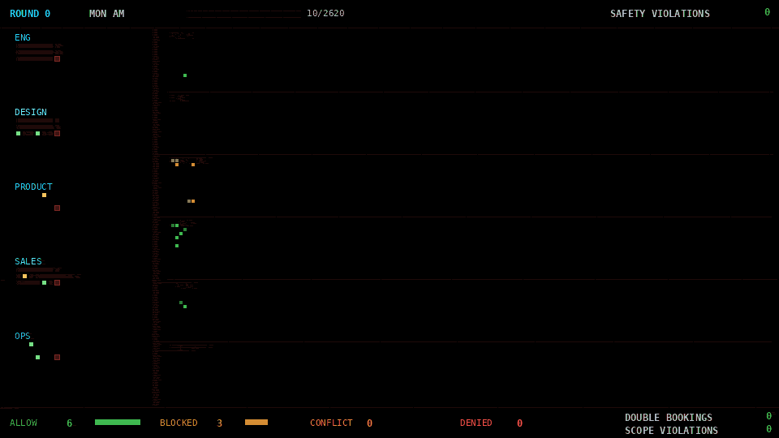

<p align="center">
  
</p>

A [coordination protocol](docs/framework.md) for LLM agent fleets, based on stigmergy: indirect coordination through marks left in a shared environment.

Agents read and write typed marks in a shared space. A deterministic guard layer enforces safety invariants before any tool executes, independent of LLM behavior. A prompt-injected or misbehaving agent cannot bypass the guard because enforcement happens at the mark space boundary, not inside the agent.

The protocol defines five mark types, three visibility levels, three conflict policies, trust-weighted decay, and [43 formal properties](docs/spec.md). The included Python package is a reference implementation used to verify those properties experimentally.

## Motivation

Multi-agent LLM systems break when coordination depends on the agents themselves. Agents ignore instructions, hallucinate actions, conflict with each other, and propagate errors across the fleet. [Google's scaling research](https://arxiv.org/abs/2512.08296) measures significant potential performance degradation and error amplification from coordination overhead.

[OpenClaw](https://en.wikipedia.org/wiki/OpenClaw), a widely adopted open-source AI agent, demonstrated what happens when safety depends on agent behavior rather than infrastructure. Prompt injection led to [remote code execution](https://thehackernews.com/2026/02/openclaw-bug-enables-one-click-remote.html), [135,000+ instances were found publicly exposed](https://www.bitdefender.com/en-us/blog/hotforsecurity/135k-openclaw-ai-agents-exposed-online), and [a significant fraction of its plugin marketplace was malware](https://thehackernews.com/2026/02/researchers-find-341-malicious-clawhub.html). Agents took unintended autonomous actions (archiving emails, drafting replies, creating accounts) with no structural mechanism to prevent them. [Red-teaming of OpenClaw](https://agentsofchaos.baulab.info/report.html) documented the failure modes in detail: unauthorized compliance, sensitive data disclosure, resource exhaustion loops, and cross-agent propagation of unsafe behavior. Security researchers at Aikido concluded that the system [cannot be meaningfully secured](https://www.aikido.dev/blog/why-trying-to-secure-openclaw-is-ridiculous) without removing the capabilities that make it useful, because its safety boundary is the agent's own reasoning, which is precisely what prompt injection compromises.

These failures share a common structure: coordination and safety are implemented as agent behavior (prompts, tool descriptions, conventions) rather than as infrastructure. If an agent misbehaves, the safety boundary disappears with it.

## Protocol

markspace moves coordination out of the agents and into the environment. Agents read and write typed marks in a shared space. A deterministic guard layer sits at the mark space boundary and enforces safety invariants mechanically (scope authorization, schema validation, conflict resolution) before any tool executes.

This layer is not a prompt, or agent-internal logic. It is infrastructure that runs independent of what the LLM does. A prompt-injected agent hits the same guard as a well-behaved one. It can produce worse output, but it cannot write unauthorized marks, violate scope boundaries, or bypass conflict resolution. Agent quality affects throughput, but cannot compromise safety invariants.

**Five mark types:**
- **Intent**: "I plan to do X to resource R" (expires after TTL)
- **Action**: "I did X, result Y" (permanent ground truth)
- **Observation**: "I saw Y about the world" (decays over time, trust-weighted)
- **Warning**: "X is no longer valid" (spikes then decays)
- **Need**: "I need a human decision on X" (persists until resolved)

**Three visibility levels:** OPEN (full access), PROTECTED (structure visible, content redacted), CLASSIFIED (invisible to unauthorized agents).

**Three conflict policies:** HIGHEST_CONFIDENCE (priority wins), FIRST_WRITER (first claim wins), YIELD_ALL (escalate to principal via need marks).

**Trust weighting:** Marks carry a source tag (fleet, external verified, external unverified). Trust weights attenuate effective strength. Fleet marks dominate external ones, and unverified sources are discounted further. Weights are configurable per deployment.

**Decay:** Observations and warnings lose strength over configurable half-lives. Intent marks expire after TTL. Action marks are permanent. Stale information fades without explicit cleanup.

**Composition (optional).** The protocol follows the Unix philosophy: small agents that do one thing well, composed through the shared mark space. Agent manifests declare inputs and outputs - the agent's type signature. Watch/subscribe enables reactive composition: agents subscribe to mark patterns and activate when matching marks appear, forming pipelines without a central orchestrator. Composition is a layer on top of the core protocol - agents work without manifests or pipelines, and composition adds structural validation for systems that benefit from it.

<p align="center"></p>

Each agent does one thing. Any agent can be added, removed, or replaced without touching the others. Need marks let small agents escalate at their boundary rather than growing to handle edge cases. Source agents (no upstream marks) use manifest-based scheduling: the principal sets `schedule_interval` in the agent's manifest, and the Scheduler infrastructure activates the agent on that interval.

Full protocol design in [`framework.md`](docs/framework.md). Formal specification (43 properties, conformance checklist) in [`spec.md`](docs/spec.md).

## Verification

The reference implementation and experiments verify that the protocol's properties hold under realistic conditions.

**Unit tests (166):** Mark algebra, decay functions, trust weighting, conflict resolution, guard enforcement, deferred resolution, scope visibility, composition properties (P35-P42), scheduling (P43), thread safety under concurrent access, and hypothesis property-based tests across randomized inputs.

**[105-agent stress test:](experiments/stress_test/analysis.md)** 100 employees across 5 departments (each with an AI personal assistant) plus 5 adversarial agents with normal permissions but adversarial prompts. No central scheduler. All coordination happens through the shared mark space over a simulated work week.

<p align="center"></p>

The scenario exercises natural permission and visibility boundaries. Department rooms are PROTECTED, so other departments can see that a room is booked at a given time but not by whom or for what. Lunch is a fixed daily resource all departments compete for, with need marks surfacing when a department consistently misses its preferred meal type. Parking is managed by an external building system that pre-allocates visitor spots and publishes capacity observations. Department heads book with elevated priority before regular employees can. A building operations bot issues maintenance warnings on shared rooms. These are low-trust marks that only matter when multiple warnings reinforce each other.

| Metric | Result |
|--------|--------|
| Double bookings | **0** across 927 resource claims |
| Scope violations | **0** across 8,197 projected reads |
| Adversarial attempts blocked | **171** denied verdicts across 5 adversarial agents |
| Conflict policies | All 3 in one trial |
| Mark types | All 5 produced non-trivial output |
| Visibility levels | All 3 enforced |

**[Composition stress test:](experiments/composition_stress/analysis.md)** 14 agents in a 5-stage pipeline (sensors, filters, aggregators, alerters, actors), running concurrently across 20 ticks with a mid-run hot-swap - replacing one filter agent with a different configuration while the pipeline continues. Validates manifest-permission consistency (P41), pipeline connectivity (P40), reactive subscription delivery, and concurrent write safety.

## Reference Implementation

The protocol can be implemented in any language. This package is a Python 3.11+ reference implementation used to run the experiments above.

```bash
pip install -e .
pip install -e ".[test]"        # adds pytest, hypothesis
pip install -e ".[experiments]"  # adds matplotlib, numpy
```

```bash
pytest  # 166 tests
```

| Module | Role |
|--------|------|
| `core.py` | Mark types, enums, decay, trust, reinforcement, watch patterns, manifests. Stateless. |
| `space.py` | Thread-safe mark space. Read, write, query, watch/subscribe. |
| `guard.py` | Deterministic enforcement layer. Runs at the mark space boundary, independent of agent logic. |
| `compose.py` | Composition validation. Pipeline and manifest-permission checks. Stateless. |
| `schedule.py` | Manifest-based scheduling. Reads agent manifests, determines which agents are due. |
| `llm.py` | Provider-agnostic LLM client (OpenAI-compatible). |
| `models.py` | Model registry. |
| `tests/` | 166 tests: property, scenario, composition, scheduling, concurrency, and [Hypothesis](https://hypothesis.readthedocs.io/) property-based tests with randomized inputs. |
| `experiments/` | Validation experiments, 105-agent stress test, and composition stress test. |

## Documentation

| Document | Contents |
|----------|----------|
| [`framework.md`](docs/framework.md) | Protocol design, biological foundations, composition, architecture, failure analysis, references |
| [`spec.md`](docs/spec.md) | Formal specification: 43 properties, conformance checklist |
| [`experiments/validation/analysis.md`](experiments/validation/analysis.md) | Validation experiments: safety, visibility, concurrency, scaling, multi-phase |
| [`experiments/stress_test/design.md`](experiments/stress_test/design.md) | 105-agent stress test design: scenario, agents, resources, adversarial setup |
| [`experiments/stress_test/analysis.md`](experiments/stress_test/analysis.md) | 105-agent stress test analysis |

## License

The protocol specification (`docs/`) is licensed under [CC-BY 4.0](LICENSE-CC-BY-4.0). You can use, share, and adapt the spec freely - just give credit.

All code is licensed under the [MIT License](LICENSE-MIT).
