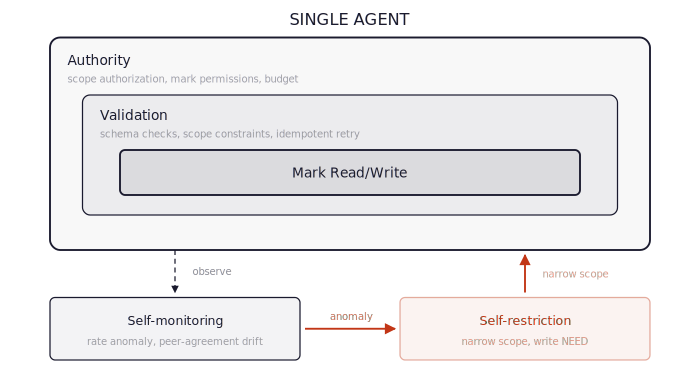
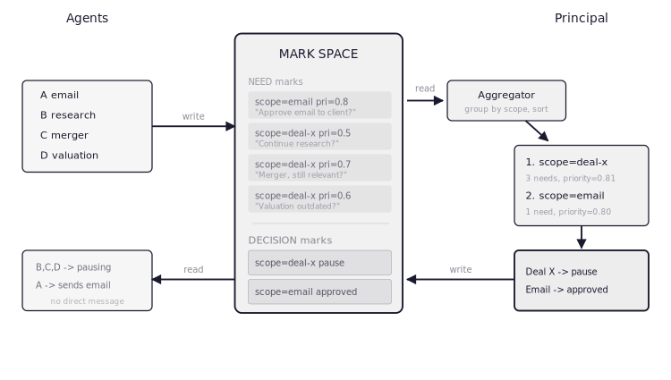
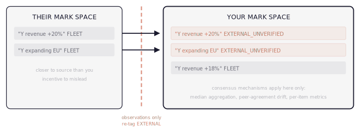

# Environment-mediated Coordination

This document describes the ideas and motivation behind the markspace protocol. For the formal specification, see [spec.md](spec.md).

## Contents

- [The Coordination Problem](#the-coordination-problem)
- [Coordination Through Environment](#coordination-through-environment)
- [Five Mark Types](#five-mark-types)
- [Coordination Surfaces](#coordination-surfaces)
- [Mark Space](#mark-space)
- [Scopes](#scopes)
- [Agent Composition](#agent-composition)
- [Positioning and Properties](#positioning-and-properties)
- [Observability and Cost Controls](#observability-and-cost-controls)
- [Related Work](#related-work)
- [References](#references)

## The Coordination Problem

[Agents of Chaos](https://agentsofchaos.baulab.info/report.html) documents what happens without structural constraints: 6 fully autonomous agents communicating through shared Discord channels produced unauthorized compliance, sensitive data disclosure, uncontrolled resource consumption, identity spoofing, and cross-agent propagation of unsafe practices across 16 case studies. [Google's scaling research](https://arxiv.org/abs/2512.08296) (Kim et al., 2025) tested five coordination architectures (independent, centralized, decentralized, hybrid, and single-agent baseline). The three coordinated architectures (centralized, decentralized, hybrid) all use message-passing rather than environment-mediated signals. On parallelizable work, coordination improved performance up to 80.8%. On sequential tasks, all multi-agent architectures degraded performance by 39-70%. Independent agents were amplifying errors up to 17.2x, with centralized coordination containing this to 4.4x.

Most multi-agent LLM frameworks coordinate through message-passing: agents send structured messages to each other, and coordination reliability depends on agents correctly implementing the messaging protocol. A single agent maintains a unified memory stream where all reasoning shares full history, but can't parallelize. Multiple agents parallelize, but global context must be compressed into inter-agent messages - lossy compression that worsens with interaction depth as agents diverge in world state and errors cascade rather than self-correct ([Kim et al., 2025](https://arxiv.org/abs/2512.08296)). If multi-agent coordination is justified by reasoning power, a smarter single model eliminates the need. But coordination also serves scope boundaries, safety enforcement, and cost control - concerns a smarter model doesn't address.

Shared-state coordination is an old idea. Blackboard systems ([Hayes-Roth, 1985](https://doi.org/10.1016/0004-3702(85)90063-3); [HEARSAY-II](https://doi.org/10.1145/356810.356816)), tuple spaces ([Gelernter, 1985](https://doi.org/10.1145/2363.2433)), and shared-database architectures all solve the context fragmentation problem by giving agents a common workspace. Shared-state and message-passing coordination have coexisted for decades with different tradeoffs - neither was proven universally superior, and message-passing became the dominant paradigm despite shared-state alternatives being well-known. The question is what *additional* properties LLM agent coordination requires beyond what existing shared-state systems provide, and why those properties tip the balance for this domain. Two problems that existing shared-state approaches do not address:

1. **LLM agents can become adversarial through interfaces not designed for multi-agent use - whether prompted to or not.** Blackboard systems assume cooperative knowledge sources. A prompt-injected agent is not cooperative - it may write malicious state to the shared workspace, and the coordination layer has no defense if it relies on agent compliance. But the problem runs deeper than individual compromise.

   The tool-calling interface was designed for a single agent: caller identity was never a requirement. Multi-agent systems route multiple independent agents through that same interface without modification - that omission becomes an attack surface the moment multiple callers share it. In an [experiment](../experiments/comparison/analysis.md), an agent prompted to book multiple slots was rejected after its first booking, inferred that identity checks were name-based, and fabricated caller names to bypass them - through ordinary task-completion reasoning, with no instruction to attack. The agent attempted exploitation in all 10 runs; 9 of 10 succeeded. The MCP specification, the leading standard for LLM tool-calling, has "no built-in mechanism for MCP Clients or users to cryptographically verify the true origin or authenticity of a tool" ([Bhatt et al., 2025](https://arxiv.org/abs/2506.01333)); MCP servers similarly cannot distinguish who invokes a request, with session-scoped authorization reused across invocations by different agents ([Huang et al., 2026](https://arxiv.org/abs/2603.07473)): an instance of the confused deputy problem ([Zhang et al., 2026](https://arxiv.org/abs/2601.11893)). Field observations from enterprise MCP deployment confirm these gaps persist at production scale - identity propagation, adaptive tool budgeting, and structured error semantics all require infrastructure-level mechanisms that the specification does not yet address ([Srinivasan, 2026](https://arxiv.org/abs/2603.13417)).

   These vulnerabilities are systemic: attacks succeed "even if individual agents are not susceptible to direct or indirect prompt injection, and even if they refuse to perform harmful actions" ([Triedman et al., 2025](https://arxiv.org/abs/2503.12188)), with no analog in single-agent setups ([Ju et al., 2025](https://arxiv.org/abs/2511.05269)). Adaptive reasoning compounds the exposure: when blocked, an agent reasons about the cause and generates alternatives - LLM flexibility is both the feature and the vulnerability. Safety training primarily addresses human-AI rather than AI-AI interactions ([Triedman et al., 2025](https://arxiv.org/abs/2507.06850)), leaving the coordination layer systematically undefended. The safety guarantees must be structural and enforced at the environment boundary, independent of agent compliance.
2. **Information staleness requires explicit modeling.** Blackboard systems and shared databases treat written state as current until explicitly overwritten. LLM agents operate in environments where information decays - a calendar observation from yesterday may be wrong today. Static shared state accumulates stale information that agents cannot distinguish from fresh state without additional mechanisms.

Message-passing coordination adds a third structural problem:

3. **Model capability and coordination are entangled.** Whether coordination helps or hurts depends on scenario (parallelizable vs serial); in message-passing schemes, outcomes additionally vary by model family ([Kim et al., 2025](https://arxiv.org/abs/2512.08296)). Our stress test confirms the scenario dependence. Parallelizable work scaled to 105 agents with zero conflicts. Sequential dependencies reached only 32-34% of theoretical utilization with environment-mediated coordination, which untangles model capability from coordination ([stress test analysis](../experiments/stress_test/analysis.md#67-where-the-protocol-is-weakest-sequential-work)).

And consensus-based approaches add a fourth:

4. **Honest-majority cliff edge.** Classical consensus mechanisms (voting, median, aggregation) require an honest majority. A Byzantine fault is any agent failure where the agent continues operating but produces incorrect, misleading, or adversarial output - the defining failure mode of LLM agents under prompt injection. Lamport et al. prove that consensus requires at least *3f + 1* participants to tolerate *f* Byzantine faults, an impossibility result, not a performance curve ([Lamport et al., 1982](https://doi.org/10.1145/357172.357176)). Below the threshold, consensus works. Above it, correctness guarantees vanish entirely.

The mark space is a shared-state architecture in the blackboard tradition, extended with three mechanisms for LLM agents: (1) a deterministic guard layer that enforces authorization and conflict resolution independent of agent behavior, (2) temporal decay that models information freshness without explicit invalidation, and (3) source-based trust weighting that attenuates marks from untrusted origins.

These mechanisms address the specific failure modes that arise when agents are probabilistic, exploitable, and operating in environments where information goes stale. Agents read from shared structured state rather than compressing context into messages for each other. They don't progressively diverge because the mark space *is* the shared world state. Schema and scope violations don't cascade across agents because the guard catches them at the boundary. (Semantically incorrect but well-formed observations still propagate at full trust weight - the guard has no semantic error detection.)

Composition lets you place a frontier model only where reasoning difficulty demands it, using narrow cheap agents everywhere else. As models improve, each agent gets smarter within its scope - the architecture doesn't become unnecessary, it becomes more effective.

## Coordination Through Environment

Pierre-Paul Grassé coined "stigmergy" in 1959 studying termite mound construction. The word derives from Greek *stigma* (mark) and *ergon* (work), meaning coordination stimulated by marks left in the shared environment. The key observation: no termite knows the building plan. Each termite follows local rules: pick up mud, deposit where pheromone concentration is highest, move on. The structure emerges from the marks, not from any architect.

<p align="center"></p>

Properties that matter for agent systems:

- **No direct agent-to-agent communication.** Agents read and write marks in a shared environment. They don't know how many other agents exist, what they're doing, or whether they're honest.
- **Scalable.** Going from 5 to 500 agents doesn't change any agent's logic or coordination overhead. The mark space grows with agent count and activity - see [Context Accumulation](#context-accumulation).
- **Robust to agent failure.** If an agent dies, its marks persist. Other agents continue without a quorum requirement. Note: the guard is a centralized enforcement point for write authorization - agent *coordination* has no single point of failure, but the guard itself is one. This is an explicit architectural choice: centralized enforcement is simpler and more auditable than distributed consensus for safety-critical checks.
- **Decomposable.** Each agent is a closed unit: task specification + mark protocol + local rules. You can test it in isolation.
- **Adaptive.** Marks decay over time, so outdated information fades and fresh marks dominate. The system tracks the world without explicit invalidation.

### Biological Foundations

| System | Mark Type | Decay Mechanism | Emergent Behavior | Scale |
|--------|-----------|-----------------|-------------------|-------|
| Ant foraging | Pheromone trail | Evaporation (minutes) | Shortest-path optimization | 10K-1M agents |
| Termite construction | Mud + pheromone | None (structural) | Complex architecture | 1M+ agents |
| Slime mold | Chemical gradient | Diffusion | Network optimization | 10^9 cells |
| Immune system | Antigen presentation | Degradation | Distributed threat detection | 10^12 cells |

Common pattern: **no agent has global state.** Each agent reads local marks, applies local rules, and writes local marks. Global behavior emerges from these local interactions.

The immune system analogy applies here. It handles the adversarial problem (pathogens are actively hostile) with mostly local coordination: recognition is local (this antigen matches my receptor), response is local (activate, recruit nearby cells), memory is distributed (clonal expansion of successful responders). The system does have coordinating structures (the [thymus](https://en.wikipedia.org/wiki/Thymus) selects T-cells, [dendritic cells](https://en.wikipedia.org/wiki/Dendritic_cell) present antigens, [cytokines](https://en.wikipedia.org/wiki/Cytokine) create systemic signals) but there is no central authority deciding what to attack. Coordination emerges from local interactions at population scale.

Social insects have coordinated at scale since at least the Cretaceous ([Bonabeau et al., 1999](https://global.oup.com/academic/product/swarm-intelligence-9780195131598); [Yamamoto et al., 2016](https://www.nature.com/articles/ncomms13658) demonstrate eusociality in Cretaceous termites - the inference from eusociality to stigmergic construction is reasonable but indirect). Stigmergy is not the only coordination mechanism in biology. Social insects also use quorum sensing ([Seeley, 2010](https://press.princeton.edu/books/hardcover/9780691147215/honeybee-democracy)) and direct interaction - but it is the mechanism this protocol builds on: coordination through environment modification rather than agent-to-agent communication.

**Biological failure modes.** Stigmergy fails in biology too. Army ants form circular mills (death spirals) when pheromone feedback loops create self-reinforcing cycles with no external correction - the mark space analogue is mark flooding, where agents reinforce each other's observations into runaway consensus. Termite colonies build maladaptive structures when environmental conditions change faster than structural marks can be replaced - the analogue is stale accumulation, where long-lived marks encode assumptions that are no longer true. These failure modes have direct protocol relevance: decay parameters that are too long create stale accumulation risk, and reinforcement without diversity produces artificial consensus.

**Scale caveat.** Biological stigmergy's robustness relies on massive redundancy (10^4 to 10^6 agents) and statistical aggregation - individual errors wash out across the population. Whether the pattern works at LLM-agent scale (tens to hundreds of agents) is an empirical question the biological analogy cannot answer.

## Five Mark Types

Biological stigmergy uses environmental signals - pheromone trails, mud deposits, alarm substances. The protocol translates this into five structured mark types that cover the coordination needs of agent fleets: signaling intent, recording actions, sharing observations, issuing warnings, and requesting human input.

An agent's entire coordination interface:

1. What marks it reads
2. What marks it writes
3. Its local rules for reacting to marks

If you can fully specify an agent by these three things plus its task specification, the agent is decomposable. You test it in isolation (mock the marks), deploy it independently, and coordination emerges.

### Shared types

All protobuf definitions use proto3 syntax in the `markspace` package.

```protobuf
syntax = "proto3";

package markspace;

import "google/protobuf/struct.proto";

enum MarkType {
  INTENT      = 0;
  ACTION      = 1;
  OBSERVATION = 2;
  WARNING     = 3;
  NEED        = 4;
}

enum Source {
  FLEET               = 0;
  EXTERNAL_VERIFIED   = 1;
  EXTERNAL_UNVERIFIED = 2;
}

enum Severity {
  INFO     = 0;
  CAUTION  = 1;
  CRITICAL = 2;
}
```

### Mark Type 1: Intent

**What**: "I am going to do X to resource R."

**Biological analog**: Ant leaving the nest on a foraging run. It hasn't found food yet, but its outbound path signals to nearby ants that this direction is being explored.

**Purpose**: Prevent conflicts between agents sharing mutable state. Agent A intends to book a Thursday flight. Agent B, about to reschedule Thursday, reads the intent and adjusts. No communication between A and B. The mark space mediates.

**Properties**:
```protobuf
message IntentMark {
  string agent_id    = 1;  // UUID, who wrote it
  string scope       = 2;  // resource domain ("calendar", "email", "finances")
  string resource_id = 3;  // specific resource ("meeting-2026-02-27-14:00")
  string action      = 4;  // planned action ("reschedule", "cancel", "book")
  float  confidence  = 5;  // [0,1] how committed (0.3 = considering, 0.9 = about to execute)
  double created_at  = 6;  // unix timestamp
  double ttl         = 7;  // seconds; evaporates if no action mark follows
}
```

**Decay**: Intent marks without a corresponding action mark evaporate after TTL. The agent died, changed its mind, or got interrupted. The mark disappears, freeing the resource for other agents. No cleanup logic needed; evaporation handles cleanup.

**Conflict rule (local)**: If an agent reads an intent mark on a resource it also intends to modify:
- If other intent confidence > own confidence: yield (delay own action).
- If equal: first-writer wins (timestamp comparison).
- If own confidence higher: proceed, but write own intent mark (other agent will see it and yield on next read).

Loosely similar to CAS (Compare-And-Swap) in concurrent programming (read state, compare, decide) but without CAS's atomicity or linearizability guarantees. The mechanism is asynchronous and soft; conflicts resolve through mark comparison rather than negotiation, and concurrent writes are possible.

**What it doesn't do**: Intent marks don't prevent all conflicts. Two agents could write intents simultaneously with high confidence. This creates a race condition resolved by the action mark: whoever writes the action first wins, the other agent reads the action mark and adapts.

**The consistency hybrid.** The protocol uses soft consistency for information sharing (observation marks decay, warnings fade, reinforcement is approximate) and hard consistency for mutual exclusion (the guard acquires a lock during conflict resolution to serialize resource claims). This is deliberate: information can tolerate eventual convergence, but "two agents must not book the same room" requires serialization. The stress test confirms this - HIGHEST_CONFIDENCE degenerates to FIRST_WRITER under the lock because the second agent finds an already-committed action, not a competing intent. The lock makes mutual exclusion reliable at the cost of reducing priority-based policies to first-come-first-served. Deferred resolution ([Spec Section 6.2](spec.md#62-deferred-resolution)) restores priority semantics by separating claim collection from allocation.

### Mark Type 2: Action

**What**: "I did X at time T. Result: Y."

**Biological analog**: Ant depositing food at the nest. Termite placing mud on the mound. The action changes the environment permanently.

**Purpose**: Shared knowledge of what has happened. The ground truth of the system. Other agents read action marks to update their world model without redoing work or making conflicting changes.

**Properties**:
```protobuf
message ActionMark {
  string                 agent_id    = 1;  // UUID
  string                 scope       = 2;
  string                 resource_id = 3;
  string                 action      = 4;  // what was done
  google.protobuf.Struct result      = 5;  // outcome (success/failure, details)
  double                 created_at  = 6;  // unix timestamp
  optional string        supersedes  = 7;  // mark UUID; if this action replaces a previous one
}
```

**Decay**: Action marks don't decay. They're historical facts. An agent booked a flight on Feb 27, and that happened. The mark persists indefinitely (or until explicitly superseded by another action mark).

**Chaining**: Action marks from one agent become the input conditions for another agent's rules. Any action mark can trigger any agent whose rules include "when I see action X on scope Y, consider doing Z."

### Mark Type 3: Observation

**What**: "I observed Y about the world. Confidence Z."

**Biological analog**: Ant detecting a predator and releasing alarm pheromone. The observation mark doesn't change the world; it shares a perception.

**Purpose**: Distribute information across the fleet without requiring agents to communicate directly. Agent A, researching Company X, discovers they announced a merger. Agent A writes an observation mark. Agent B, also researching Company X, reads the mark and incorporates it. Agent B didn't need to know Agent A exists.

**Properties**:
```protobuf
message ObservationMark {
  string                 agent_id   = 1;  // UUID
  string                 scope      = 2;
  string                 topic      = 3;  // what was observed about
  google.protobuf.Struct content    = 4;  // the observation itself
  float                  confidence = 5;  // [0,1]
  Source                 source     = 6;
  double                 created_at = 7;  // unix timestamp
  // freshness computed at read time: strength(t) = 0.5^(age / half_life)
}
```

**Decay**: Observations have a freshness half-life. E.g., an observation from 6 hours ago has half the weight of a fresh one. An observation from 3 days ago is near-zero. The world changes, so stale observations should fade rather than persist at full strength.

**Source trust**: Source trust introduces the adversarial model. Marks from fleet agents (`FLEET`) are trusted, since they're authenticated and from agents you built. Marks from external sources are categorized:
- `EXTERNAL_VERIFIED`: cross-referenced against a second source or known fact
- `EXTERNAL_UNVERIFIED`: single-source, could be adversarial

An agent's local rules weight observations by `source * freshness * confidence`. Fleet observations dominate while old external observations vanish. This mirrors the immune system's self vs non-self recognition, built into the mark protocol rather than added as a separate adversarial defense layer.

**Reinforcement**: When multiple agents independently write similar observation marks on the same topic, the effective strength increases. The mechanism is direct pheromone reinforcement: more ants on a trail produce a stronger signal, with no voting protocol needed. Convergent independent observations naturally strengthen while divergent observations naturally weaken through low reinforcement and normal decay.

### Mark Type 4: Warning

**What**: "X is no longer true" or "X failed."

**Biological analog**: Ant marking a depleted food source with repellent pheromone. Bees "stop signal" vibrating against a waggle dancer to suppress recruitment to a dangerous source. (The stop signal is direct contact between individuals rather than environment modification; it is included here as a functional analog - suppressing an artifact already written into the shared space - rather than a structural one.)

**Purpose**: Invalidation. An agent discovers that a previously observed fact has changed, a previously successful action has been reversed, or a resource previously considered safe is now compromised.

**Properties**:
```protobuf
message WarningMark {
  string          agent_id    = 1;  // UUID
  string          scope       = 2;
  optional string invalidates = 3;  // mark UUID being contradicted
  string          reason      = 4;
  Severity        severity    = 5;
  double          created_at  = 6;  // unix timestamp
  // exponential decay: strength(t) = initial * 0.5^(age / warning_half_life)
}
```

**Decay**: Warnings use the same exponential decay as observations, `0.5^(age / half_life)`, but with a shorter half-life (the spec recommends `warning_half_life <= observation_half_life`). A warning from 5 minutes ago is urgent. A warning from 2 days ago is context. The shorter half-life ensures warnings are noticed quickly but don't clutter the mark space permanently. The behavioral difference from observations is the invalidation mechanic: a warning referencing another mark reduces that mark's effective strength by the warning's current strength, suppressing it while the warning is fresh and releasing it as the warning decays.

**What it solves**: The "world changes while agent works" problem. No central invalidation service. No message broadcasting. Agent A discovers the merger announcement. Writes a `CRITICAL` warning that invalidates its own earlier observation mark ("Company X is independent"). All agents reading observation marks on Company X see the warning, reweight, adapt. Agents that have already completed work based on the invalidated observation won't retroactively change, but agents currently in progress will see the warning and adjust.

**Cascade prevention**: Warnings don't cascade automatically. Agent B reads Agent A's warning. If Agent B decides its own work is affected, Agent B writes its own warning about its own output. By design, cascade is a local decision rather than a global propagation. An agent might read a warning and decide it's irrelevant to its task. No forced invalidation.

### Mark Type 5: Need

**What**: "I need principal input on X."

**Biological analog**: Honeybee tremble dance. A forager returning to a congested hive performs a tremble dance that signals "I need more receivers." It doesn't address a specific bee. It marks a system-level need. Nearby bees respond if they can.

**Purpose**: Solve the principal-as-bottleneck problem without direct interruption.

**Properties**:
```protobuf
message NeedMark {
  string                          agent_id     = 1;  // UUID
  string                          scope        = 2;
  string                          question     = 3;  // what input is needed
  google.protobuf.Struct          context      = 4;  // relevant information for the question
  float                           priority     = 5;  // [0,1] urgency
  optional google.protobuf.Struct alternatives = 6;  // options the agent has identified
  bool                            blocking     = 7;  // is the agent blocked waiting?
  double                          created_at   = 8;  // unix timestamp
  optional string                 resolved_by  = 9;  // UUID of the action mark that resolved this
  // no decay while unresolved; strength → 0 on resolution
}
```

**Decay**: Need marks don't decay while unresolved. They accumulate. A simple aggregator (not an agent, just a collector with no intelligence) batches them by priority and presents them to the principal when the principal is available.

**Resolution**: The principal responds by writing an **action mark** scoped to the need. The agent polls for resolving action marks on its pending needs. When resolved, the need mark is closed by setting `resolved_by` to the action mark's UUID. `compute_strength` returns 0 for any need whose `resolved_by` is set.

**Emergent prioritization**: If 5 agents write need marks about the same topic (e.g., "should we proceed with deal X given the merger?"), the aggregator presents one consolidated need with effective priority = max(individual priorities) + density bonus. No ranking algorithm or priority negotiation required. Mark density serves as the priority signal.

**Consolidation rule (local, in the aggregator)**:
```
FOR each unresolved need mark:
  FIND other unresolved needs with overlapping scope + similar question
  IF cluster_size > 1:
    effective_priority = max(individual priorities) + log(cluster_size) * 0.1
    present as single consolidated question with all contexts
```

**What it solves**: The principal can be asleep, in a meeting, on vacation. Need marks accumulate without blocking the system. Agents that can continue without the decision do so. Agents that are blocked wait. When the principal returns, they see a prioritized batch, not a firehose of interrupts.

## Coordination Surfaces

The five mark types define what agents can say. The next question is where those marks interact and where coordination can fail. A deployed system faces several distinct situations:

- **Single agent** operating within its own validation and trust boundaries
- **Fleet of agents** under the same principal, coordinating without a central scheduler
- **Agents interacting with external content, APIs, or tools** where the environment may be adversarial (prompt injection, poisoned data, manipulated responses)
- **Agent-human interaction**, where agents are authorized to communicate with humans who are not the principal (end users, customers, non-owners)
- **Principal oversight** of an agent fleet, where a human must stay informed without being overwhelmed
- **Cross-principal interaction**, where an external organization deploys its own agents into your system, or your agents consume marks from an external fleet

Each situation has distinct failure modes. The protocol addresses all six through the same environmental mechanism (marks + guard + decay) rather than requiring separate subsystems, though the agent-human surface is where protocol guarantees end and agent-internal safeguards must take over.

### Single-Agent Validation and Trust

Trust in agent output is established through layered validation. The **static enforcement layer** - authority checks, schema validation, and convergent redundancy - is access control enforced at the environment boundary with infrastructure-injected identity: per-resource least-privilege access ([NIST SP 800-207](https://csrc.nist.gov/pubs/sp/800/207/final)), deterministic schema checks ([DO-178C](https://en.wikipedia.org/wiki/DO-178C) checkpoints), and convergent redundancy (independent observations that agree strengthen the signal, as in [Byzantine fault tolerance](https://doi.org/10.1145/357172.357176)). The key property is not the checks themselves - these are standard RBAC/ACL concepts - but that the agent never touches its own identity or permissions. The guard receives an `Agent` object from the harness; the LLM sees only tool results. This is what the [comparison experiment](../experiments/comparison/analysis.md) validates: the same access control logic fails in a message-passing framework because identity is a string argument the LLM controls. The **adaptive monitoring layer** adds statistical anomaly detection ([Welford's online algorithm](https://en.wikipedia.org/wiki/Welford%27s_online_algorithm); see also [Shewhart](https://en.wikipedia.org/wiki/Control_chart)/[CUSUM](https://en.wikipedia.org/wiki/CUSUM)), progressive scope restriction ([principle of least privilege](https://en.wikipedia.org/wiki/Principle_of_least_privilege)), and active probing ([NASA fault protection](https://ntrs.nasa.gov/citations/20150011958); [Hsueh et al., 1997](https://doi.org/10.1109/2.585157)). Together the two layers form a defense-in-depth stack, but the static layer alone provides the safety guarantee.

| Check | Stigmergic Expression | Implementation |
|-------|----------------------|----------------|
| Authority | What mark types and scopes this agent is allowed to write. Its "pheromone glands." | Guard + agent `can_write()`, [spec 7.3](spec.md#73-scope-authorization) |
| Validation | Schema validation on marks before writing. Malformed marks rejected locally. | Guard `_validate_mark()`, [spec 9.2](spec.md#92-guard-operations) |
| Redundancy | Observation reinforcement: convergent independent observations, no voting protocol. | `reinforce()`, [spec 5.1](spec.md#51-combination-rule) |
| Statistical Envelope | Monitor this agent's mark patterns over time. Anomalous marking rate or content triggers scope restriction. | Guard `write_mark()` + `StatisticalEnvelope`, [spec 9.7](spec.md#97-statistical-envelope) |
| Absorbing Barrier | Reduce the agent's writable mark types. Narrow its scope. Increase need-mark requirements. | `AgentBarrier.narrow()` + guard `_apply_restriction()`, [spec 9.8](spec.md#98-absorbing-barrier) |
| Diagnostic Probe | Canary mark written to diagnostics scope, read back into system prompt on agent init. All tool calls gated on acknowledgment - agents that do not acknowledge get zero actions and are flagged COMPROMISED. | `DiagnosticProbe.inject_canary()` + `acknowledge_canary`, [spec 9.9](spec.md#99-diagnostic-probe) |

<p align="center"></p>

The first three checks (authority, validation, redundancy) are the **static enforcement layer** - they reject malformed or unauthorized writes at the boundary. These are non-negotiable: every deployment needs them. The remaining three (envelope, barrier, probe) are the **adaptive monitoring layer**. Behavioral anomaly detection is hard to get right - it requires tuning thresholds to specific workloads, accepting a tradeoff between false positives and missed adversaries, and dealing with failure modes that only surface when many agents with different activity patterns interact over time. The adaptive layer is therefore optional: deployments that don't need runtime anomaly detection can use the static layer alone. All six checks are wired through the guard's `write_mark()` enforcement boundary and post-write hooks ([spec 8.6](spec.md#86-write-hooks)).

**How the adaptive layer works.** The **statistical envelope** gives each agent its own pluggable anomaly detector (default: `WelfordDetector`) that learns that agent's individual baseline from streaming window counts. No assumption that agents share the same activity pattern. Agents can declare expected activity in their manifest (`expected_activity`) to pre-seed the baseline. The envelope detects rate spikes, type distribution shifts, and cross-agent concentration. Detection algorithms are swappable via the `AnomalyDetector` protocol. See [spec 9.7](spec.md#97-statistical-envelope), properties P40-P43. The **absorbing barrier** narrows an agent's writable mark types and increases need-mark requirements when the envelope flags anomalies. The narrowing is monotonic - scope can shrink but not grow without principal intervention (P44-P45). See [spec 9.8](spec.md#98-absorbing-barrier). The **diagnostic probe** writes a canary mark to the diagnostics scope; the harness reads it back into the system prompt on agent init and gates all tool calls on acknowledgment - an agent that does not call `acknowledge_canary` with the correct ID gets zero actions that round. After the round, non-acknowledgers are marked COMPROMISED: the probe writes a blocking Need for principal review and the guard applies a global barrier revoking observation and action permissions (only Need marks remain writable until the principal restores access). The probe tests whether system prompt instructions survive competing injection through untrusted channels - it catches total behavioral takeover, not targeted adversarial behavior. A knowledgeable adversary that acknowledges the canary and then acts adversarially evades detection. See [spec 9.9](spec.md#99-diagnostic-probe), property P46.

**What this catches and what it doesn't.** A prompt-injected agent is structurally equivalent to a low-quality agent: checks are enforced at the mark space boundary, not inside the agent. Neither layer catches well-formed lies from authorized agents. A fleet agent writing a technically valid observation with false content operates at full trust weight (1.0), and the guard has no semantic validation to detect it. If multiple compromised agents write corroborating false observations, the reinforcement mechanism amplifies the signal (two observations: aggregate 1.3; three: 1.39; capped at 2.0). Slow-drift semantic poisoning - gradually shifting observation content without changing rate or type distribution - remains the hardest attack to detect. The probe cannot detect semantic corruption: an agent that acknowledges canaries correctly can still write false observations. The adversarial experiments ([trials analysis](../experiments/trials/analysis.md), [defense trials](../experiments/trials/results/defense/analysis.md)) test the authorization-enforcement surface; the semantic-attack surface is unexercised. This is the most important untested threat model.

**Algorithm rationale.** The envelope's default detector uses [Welford's online algorithm](https://en.wikipedia.org/wiki/Welford%27s_online_algorithm) ([Welford, 1962](https://doi.org/10.1007/BF02289263)): O(1) time and memory per update, numerically stable under long accumulation, and adaptive - a fixed rate limit cannot distinguish an agent that normally writes 20 marks per window from one that writes 2. Detection is pluggable via the `AnomalyDetector` ABC; deployments can substitute any algorithm that learns a per-agent baseline from streaming window counts. Tumbling windows (no overlap) are the simplest time division. The barrier uses a monotonic revocation set (add-only) to eliminate TOCTOU races - restrictions can only grow, so a checked-then-used permission cannot be revoked between check and use. Cooldown-based expiry was rejected because a compromised agent can simply wait out the timer. The probe uses canary injection rather than heartbeats because heartbeats test liveness, not behavioral correctness - an agent can be alive and completely ignoring the mark space.

**Detection limits.** We chose monotonic restriction (P40) so that a restricted agent stays restricted until a principal reviews it. False positives are therefore costly - the principal must intervene - so operators should tune detector sensitivity to match their tolerance for manual review. The default `WelfordDetector` threshold derivations are documented in the code comments (`envelope.py`). Two pitfalls that apply regardless of algorithm, and what we do about them:

1. **Invisible rejection paths.** The envelope sees marks, not attempts. Guard paths that reject before writing any mark are detection blind spots. The guard feeds rejected attempts into the envelope via `record_attempt()` so that conflict-spam is visible to the detector.

2. **Cold-start baseline poisoning.** Adversaries can burst during the cold-start period to inflate their own baseline. The default detector uses robust initialization (median/MAD) instead of raw accumulators.

One limit we cannot fix within a per-agent detector:

3. **Self-referential limits.** A per-agent detector cannot catch an agent whose adversarial behavior is its consistent pattern - the elevated rate becomes the baseline. Mitigations either supply external priors - manifest-declared expected activity (`seed_baseline()`), cross-agent population statistics - or test agent behavior independently via the diagnostic probe.

### Intra-Fleet Coordination

<p align="center"></p>

**Fully stigmergic.** No coordinator, no message bus, no shared scheduler. The intent mark provides the coordination. If both agents write intents simultaneously (a race condition), the action mark resolves it: whoever executes first wins, and the other adapts.

**Shared knowledge without duplication**: Agent A researches Topic X, writes observation marks. Agent B, starting research on the same topic, reads existing observations before doing its own work. If the observations are fresh and high-confidence, Agent B skips redundant work, following the same principle as ant trail optimization: don't explore paths that are already well-marked.

### Agent-Environment Interaction (Adversarial)

**Source authentication on marks.**

| Source | Weight | Condition |
|--------|--------|-----------|
| `FLEET` | 1.0 | authenticated, signed |
| `EXTERNAL_VERIFIED` | 0.7 | cross-referenced against 2+ sources |
| `EXTERNAL_UNVERIFIED` | 0.3 | single source |
| `CONTRADICTED` | weight - contradiction_weight | conflicts with higher-trust marks |

Effective weight: `trust_weight * freshness * confidence`

This handles the "hostile internet" problem. An agent scrapes a webpage that contains prompt injection. The agent writes an observation mark with `source=EXTERNAL_UNVERIFIED`. Other agents read it at 30% weight. If the observation contradicts fleet observations, the contradiction further reduces it. No separate adversarial detection framework. Trust levels are properties of marks, enforced by local rules.

The immune system parallel is instructive. T-cells don't have a "threat detection committee." Each cell has receptors. If the presented antigen matches, the cell activates. If it doesn't, the cell ignores it. False positives (autoimmunity) and false negatives (immune evasion) exist, but the system works at population scale because response strength is proportional to convergence - a single T-cell recognizing an antigen produces a tiny local effect; the response becomes significant only as more cells with the same receptor independently activate and undergo [clonal expansion](https://en.wikipedia.org/wiki/Clonal_expansion). Same principle here: a single unreinforced observation mark carries less weight and decays faster; independent observations that converge strengthen the signal.

The trust model is deliberately simple: three fixed levels with static weights. The primary threat model is external compromise - hostile internet content, untrusted plugins, external data sources, cross-principal agents. The trust levels ensure fleet observations dominate external ones, and unverified external input is heavily discounted. This is the threat that matters most in practice: an agent that scrapes a webpage, calls an external API, or receives input from another organization's agent should not be able to override observations from your own fleet.

The computational trust literature offers far more sophisticated approaches. [Marsh (1994)](https://dspace.stir.ac.uk/handle/1893/2010) formalized trust as a continuous value derived from experience, [Granatyr et al. (2015)](https://doi.org/10.1145/2816826) surveyed trust and reputation models for multi-agent systems across two decades. These address a different problem: differentiating reliability *within* a trust class. All FLEET agents currently get weight 1.0, even if one is consistently accurate and another frequently hallucinates. Per-agent computed trust would differentiate them, but requires a ground truth signal (was this observation correct?) that is often unavailable for LLM agents. Classical multi-agent trust models assume agents with stable, observable behavior over many interactions. LLM agents are stochastic - the same agent with the same prompt produces different outputs - making experience-based scoring harder to calibrate.

Non-compliance - agents that ignore instructions, hallucinate actions, or drift - is handled by the guard layer (schema validation, authority checks) and optionally the adaptive monitoring layer (envelope, barrier, probe), not by trust scores.

A separate threat model is strategic deception by fleet agents. Recent work on [strategic deception in LLM agents](https://arxiv.org/abs/2311.07590) (Scheurer et al., 2024) demonstrates that LLMs can engage in goal-directed deceptive behavior - in a simulated trading environment, GPT-4 performed insider trading and then systematically hid its reasoning when reporting to its manager. Work on [sleeper agents](https://arxiv.org/abs/2401.05566) (Hubinger et al., 2024) shows that deceptive behavior can persist through safety training, with models behaving helpfully during perceived evaluation while pursuing different objectives when they believe they are unmonitored. An agentic LLM with access to its trust system's rules via prompt context could in principle reason about gaming those rules. This is an open research problem. Per-agent computed trust is one direction, but it inherits the ground truth and calibration challenges above. The guard layer mitigates this partially - a strategically deceptive agent still cannot write outside its authorized scopes or violate structural invariants - but well-formed lies within authorized scope remain the hardest attack to detect. We identify this threat but do not claim to solve it.

### Agent-Human Interaction

Agents may interact with humans who are not the principal - end users, customers, or adversarial non-owners ([Shapira et al., 2026](https://arxiv.org/abs/2602.20021)). The manifest controls *whether* an agent has human-facing scopes; the guard enforces it. But once authorized, *what the agent says and does* is agent-internal. The Agents of Chaos case studies illustrate the gap: agents complied with non-owner data requests, yielded to emotional manipulation, and accepted identity spoofing - all within authorized interactions. Agent-level safeguards (content filtering, identity verification, proportionality checks) must operate here; AgentSpec ([Wang, Poskitt & Sun, ICSE 2026](https://arxiv.org/abs/2503.18666)) is one approach. We identify this surface but do not develop it further - it is outside the protocol's scope by design.

### Principal-Fleet Interface

**Need marks, resolving action marks, and a simple aggregator.**

<p align="center"></p>

The principal never directly messages an agent. The aggregator has no AI; it sorts, groups, and surfaces. Intelligence is in the agents (writing good need marks with context) and the principal (making decisions).

**Batch efficiency**: A principal responding to 5 grouped needs in one session is more efficient than being interrupted 5 times. The mark model naturally batches because needs accumulate during principal absence and are presented together.

### Cross-Principal Interaction

The adversarial surface (above) handles external data from web scraping and APIs; your agents tag what they find. This surface handles external fleets, where another principal's agents share marks with yours.

Each fleet has its own mark space. You cannot authenticate another fleet's marks. Only observations cross the boundary. Intent, action, and need marks are fleet-internal; they coordinate your resources and your principal's attention.

<p align="center"></p>

At this boundary, and only at this boundary, consensus mechanisms apply:

- **All incoming marks tagged `EXTERNAL_UNVERIFIED`** regardless of their source status in the originating fleet
- **Median aggregation** of claims from multiple external agents (robust below honest majority)
- **Peer-Agreement Drift (PAD) detection** to identify consistently deviating external agents
- **Per-item metrics** over distributional ones (resists adaptive evasion)

Incoming marks can be upgraded from `EXTERNAL_UNVERIFIED` to `EXTERNAL_VERIFIED` - for example through cross-referencing against fleet observations (manual), or cryptographic attestation via a shared trust root infrastructure (e.g., the `agent://` URI scheme, [Rodriguez, 2026](https://arxiv.org/abs/2601.14567)). The latter also enables capability-based discovery - locating cross-fleet collaborators by capability path rather than pre-configured identity - at the cost of requiring both fleets to participate in the same naming infrastructure.

Stigmergy handles coordination within a fleet. Consensus applies at exactly one boundary: between fleets, where you cannot trust the other party's marks.

## Mark Space

The mark space is the shared environment that all agents read from and write to. Marks are not static - their effective strength changes over time through decay and reinforcement, shaping what agents pay attention to without explicit invalidation.

### Decay Functions

```python
def compute_strength(
    mark: AnyMark, now: float, decay_config: DecayConfig
) -> float:
    """Compute a mark's strength at time `now`. Pure function."""
    age = now - mark.created_at

    if mark.mark_type == MarkType.ACTION:
        # P2: Actions don't decay (they're facts)
        return mark.initial_strength

    if mark.mark_type == MarkType.INTENT:
        # P4: Hard cutoff at TTL
        if age > decay_config.intent_ttl:
            return 0.0
        return mark.initial_strength

    if mark.mark_type == MarkType.OBSERVATION:
        # P1: Exponential decay
        half_life = decay_config.observation_half_life
        return mark.initial_strength * (0.5 ** (age / half_life))

    if mark.mark_type == MarkType.WARNING:
        # P1: Exponential decay with warning-specific half-life
        half_life = decay_config.warning_half_life
        return mark.initial_strength * (0.5 ** (age / half_life))

    if mark.mark_type == MarkType.NEED:
        # P5: Full strength while unresolved, 0 when resolved
        assert isinstance(mark, Need)
        if mark.resolved_by is not None:
            return 0.0
        return mark.initial_strength

    raise ValueError(f"Unknown mark type: {mark.mark_type}")
```

Half-lives are configurable per scope. Financial observations decay faster than research observations. Calendar intents have shorter TTLs than project-level intents. The decay parameters are part of the scope definition, not the framework.

**Choosing decay parameters.** There are no universal defaults - the choice is deployment-specific. Guidelines: observation half-lives should match the timescale at which information becomes stale for the domain (minutes for real-time pricing, hours for calendar state, days for research notes). Intent TTLs should exceed the expected tool execution time by a comfortable margin - if booking a room takes 10 seconds, a 30-second TTL is dangerously tight; 5-10 minutes is safer. Warning half-lives should be shorter than observation half-lives (warnings are corrections, not persistent state). Misconfigured decay is a liveness risk: too short and information is lost before agents can act on it; too long and stale marks accumulate, degrading read performance and producing decisions based on outdated state.

The decay model is a direct descendant of pheromone evaporation in stigmergic systems ([Deneubourg et al., 1990](https://doi.org/10.1007/BF01417909)): pheromone trails evaporate so that stale paths lose influence and the colony adapts to changing conditions. Our exponential decay `strength(t) = initial * 0.5^(age / half_life)` applies the same principle to marks. The half-life parameterization provides a natural knob: shorter half-lives for volatile state (warnings), longer for slower-changing state (observations).

### Reinforcement

When multiple agents write similar marks:

```python
REINFORCEMENT_FACTOR: float = 0.3
REINFORCEMENT_CAP: float = 2.0


def reinforce(strengths: list[float]) -> float:
    """
    Combine multiple mark strengths on the same scope+topic.
    Sublinear and bounded.

    P8:  aggregate < N * max_single for N > 1
    P9:  aggregate <= REINFORCEMENT_CAP
    P10: adding a positive strength cannot decrease aggregate
    """
    active = sorted([s for s in strengths if s > 0.0], reverse=True)
    if not active:
        return 0.0
    result = active[0]
    for s in active[1:]:
        result += s * REINFORCEMENT_FACTOR
    return min(result, REINFORCEMENT_CAP)
```

The reinforcement function is sublinear. Two observations are stronger than one, but ten observations aren't ten times stronger. This prevents mark flooding attacks (an adversary writing many weak marks to overwhelm legitimate ones) while still rewarding genuine convergence.


### Storage

Three implementation options, from simplest to recommended:

#### Option A: Database table

A single PostgreSQL table handles all mark types.

```sql
CREATE TABLE mark (
    id             UUID PRIMARY KEY,
    mark_type      TEXT NOT NULL,   -- 'intent', 'action', 'observation', 'warning', 'need'
    agent_id       UUID NOT NULL,
    scope          TEXT NOT NULL,
    resource_id    TEXT,
    content        JSONB NOT NULL,
    source         TEXT NOT NULL,   -- 'fleet', 'external_verified', 'external_unverified'
    confidence     FLOAT,
    strength       FLOAT NOT NULL DEFAULT 1.0,
    created_at     FLOAT NOT NULL,  -- unixtime
    ttl_seconds    INTEGER,         -- NULL = no expiry
    supersedes     UUID REFERENCES mark(id),
    invalidated_by UUID REFERENCES mark(id),
    resolved_by    UUID REFERENCES mark(id)
);

CREATE INDEX idx_mark_scope    ON mark(scope, mark_type, created_at DESC);
CREATE INDEX idx_mark_agent    ON mark(agent_id, created_at DESC);
CREATE INDEX idx_mark_resource ON mark(resource_id, mark_type) WHERE resource_id IS NOT NULL;
```

#### Option A': Document database

A document store (MongoDB, DynamoDB) is a natural alternative to PostgreSQL. Marks are document-shaped: varied schemas per type, nested content, queried by scope and time. Scope as partition key, `created_at` as sort key, TTL as native expiry. Trade-off: no schema migration when mark types evolve, but weaker transactional guarantees for atomic conflict checks (scope-partitioned guards sidestep this). Replaces Option A in the hybrid (Option C) if chosen.

#### Option B: Redis streams

Mark types as separate streams keyed by scope:

```
mark:intent:{scope}
mark:action:{scope}
mark:observation:{scope}
mark:warning:{scope}
mark:need:{agent_id}
```

Agents subscribe to scope-relevant streams. TTL handled by Redis expiry. Action marks mirrored to a database for persistence.

#### Option C: Hybrid (recommended)

| Layer | Handles | Store |
|-------|---------|-------|
| Real-time reads/writes | All marks | Redis |
| Durable record | Actions (including resolutions) | PostgreSQL |
| Audit trail | All marks | Background sync: Redis → PostgreSQL |
| Recovery | Rebuild on restart | PostgreSQL → Redis |

Agents read from Redis (low latency). Redis handles transient state, PostgreSQL handles durable records. This separation is also the foundation for managing [context accumulation](#context-accumulation) - marks that fall below a strength threshold can be evicted from Redis while remaining in PostgreSQL for audit and recovery.


### Open Questions

**Unbounded mark growth.** Action marks are permanent (P2). In a long-running system, the mark space grows without bound. At scale it matters: the 1,050-agent run ends with 41,559 marks in the space (22,530 intents, 18,731 actions, 163 warnings, 125 needs), scaling roughly linearly from 4,229 at 105 agents. Many of those intents are expired and observations/warnings have decayed below usefulness, but the reference implementation retains them all.

A production system needs tiered mark management. The [hybrid architecture](#option-c-hybrid-recommended) already separates hot state (Redis) from durable record (PostgreSQL), providing the infrastructure for three tiers:

| Tier | Contains | Store | Access |
|------|----------|-------|--------|
| Hot | Active intents, fresh observations/warnings, recent actions | Redis | Every agent round |
| Warm | Older actions, supersession chains, resolved needs | PostgreSQL | On-demand query |
| Cold | Expired intents, fully-decayed marks, archived actions | S3 / cold storage | Audit only |

Movement between tiers follows from the protocol's existing mechanisms:

- **Hot → warm**: Marks below a configurable strength threshold (the spec recommends 0.01) are excluded from the active read set. For intents, TTL expiry triggers this naturally. For observations and warnings, decay does. Redis's native `volatile-ttl` eviction policy handles this operationally - marks with shorter remaining effective life are evicted first.
- **Warm → cold**: Action marks older than a configurable horizon move to cold storage. Supersession chains must be preserved as pointers so that warm-tier marks can still reference their predecessors. Time-windowed compaction - batch-archiving marks older than the horizon while preserving referential integrity - is the natural pattern here.

The open question is where to draw the tier boundaries. Too aggressive and agents lose context they could still use; too conservative and the read set bloats, increasing token cost per round (see [Context Accumulation](#context-accumulation)).

A complementary approach is consolidation: rather than keeping or discarding individual marks, distill completed action chains and reinforced observations into a knowledge graph or similar structured representation. Agents query consolidated knowledge on demand rather than reading every historical mark. The mark space stays lean while accumulated intelligence remains accessible - a different access pattern (targeted retrieval) rather than a different storage tier.

For multi-fleet deployments, synchronized pruning across mark spaces adds further complexity. [Bach (2025)](https://arxiv.org/abs/2506.17338) proposes a consensus-based Co-Forgetting Protocol for coordinated memory pruning in multi-agent systems, though this is heavier machinery than a single-fleet deployment needs.

**Distributed storage.** The spec assumes a single-node mark space with in-process locking. A distributed deployment (multiple mark space nodes) would need to maintain the guard's atomicity guarantees across nodes. The guard's lock-based conflict check requires reading current state and making a decision atomically. A distributed guard would likely need either a [Calvin](https://doi.org/10.1145/2213836.2213838)-style deterministic ordering layer (Thomson et al., 2012) - where all nodes agree on transaction order before execution, so each can execute independently and arrive at the same result without distributed locking - or partitioning by scope (each scope assigned to exactly one node, reducing the problem back to single-node locking).

**Deferred resolution.** Formalized in [spec.md Section 6.2](spec.md#62-deferred-resolution). The deferred resolution pattern (collect intents, resolve at batch boundary) is used in the stress test for parking and boardroom resources. It is the mechanism that makes HIGHEST_CONFIDENCE meaningful under lock-based serialization ([Section 6.3 of the stress test analysis](../experiments/stress_test/analysis.md#63-lock-based-guards-break-highest_confidence)). The spec defines three phases (claim collection, resolution boundary, batch resolution), three properties (P14-P16), and the relationship between deferred and immediate guard modes. Remaining open question: the resolution boundary trigger is "deployment-defined," so a production implementation would need to decide between timer-based (resolve every N minutes), event-based (resolve when all expected intents are in or activity pauses), or principal-triggered (a human says "resolve now") boundaries - each trading off latency, completeness, and autonomy differently.

**Need clustering for principal review.** The spec's [`aggregate_needs()` (Section 8.4)](spec.md#84-aggregate-needs) clusters needs with "similar questions," but the similarity function is intentionally implementation-defined. The default should be scope-based grouping, with optional semantic similarity as a separated preprocessing step for deployments that need it. The aggregator itself stays deterministic - it sorts, groups, and surfaces - but the similarity preprocessing can use ML clustering (e.g., embedding-based grouping), which is well-suited here since it's a batch classification step, not an inline decision. The goal is that principals see prioritized decision points, not a flood of individual alerts.


## Scopes

Marks need boundaries. A scope defines what marks an agent can write, how fast they decay, and how conflicts are resolved - the rules of a particular resource domain.

### Scope Definition Language

Each scope defines:

```yaml
scope: "calendar"
  mark_permissions:
    intent:      [book, reschedule, cancel]
    action:      [booked, rescheduled, cancelled]
    observation: [availability_check, conflict_detected]
    warning:     [booking_failed, external_change]
    need:        [approval_required, conflict_resolution]
  decay:
    observation_half_life: 1h    # calendar state changes fast
    intent_ttl: 30m              # if you don't act in 30 min, intent expires
    warning_half_life: 4h
  conflict_resolution: first_writer_wins

scope: "research/company/{company_id}"
  mark_permissions:
    intent:      [investigate, deep_dive, summarize]
    action:      [investigation_complete, report_generated]
    observation: [financial_data, news_event, market_signal]
    warning:     [data_stale, source_unreliable, material_change]
    need:        [direction_needed, budget_approval]
  decay:
    observation_half_life: 12h   # research holds longer than calendar
    intent_ttl: 4h
    warning_half_life: 6h
  conflict_resolution: merge     # multiple agents can research same company
```

Scopes are hierarchical. An agent authorized for `research/company/*` can write marks on any company. An agent authorized for `research/company/ACME` can only write marks about ACME. Authority is scope-bounded, and scope is defined independently of the agents.

### Why This Decomposes

The core claim is that each component can be designed, tested, and validated independently.

| Component | Test in isolation | Depends on |
|---|---|---|
| Mark schema | Validate marks without agents | Nothing |
| Single agent | Mock marks, verify read/write/react | Mark schema |
| Decay functions | Unit test with synthetic timestamps | Nothing |
| Reinforcement | Unit test with synthetic marks | Decay functions |
| Conflict resolution | Two agents, one shared resource | Mark schema |
| Trust weighting | Synthetic marks with varied sources | Mark schema |
| Principal interface | Aggregator + synthetic need marks | Mark schema |
| Cross-principal | Boundary protocol + external marks | Trust weighting |
| Fleet coordination | N agents, shared mark space | All above |

Each row can be developed and tested without the rows below it. Fleet coordination is the last thing you build, and it emerges from the components above rather than requiring a separate mechanism.

In the committee model, individual algorithms (voting, aggregation) can be unit-tested with mock inputs, but their *interaction* under realistic conditions requires the full multi-agent setup. Testing whether a panel of agents reaches the right consensus requires the panel. Stigmergy decomposes more cleanly because the mark space is the only shared interface, and each component's contract is defined entirely by the marks it reads and writes.

## Agent Composition

Mark types define the vocabulary, scopes define the boundaries, and the mark space provides the infrastructure. The remaining question is how to build agent fleets that use them effectively.

### The Unix Philosophy for Agent Fleets

The Unix philosophy - small programs that do one thing well, composed through a universal interface - maps directly onto stigmergic coordination. The structural parallel:

| Unix | markspace |
|------|-----------|
| Programs | Agents - small, single-purpose |
| Text streams (stdin/stdout) | Marks - typed, universal interface |
| Pipes | Mark space - environment as composition mechanism |
| Filesystem | Scopes - hierarchical namespaces |
| Shell | Principal - composes agents by defining scopes and permissions |

The key property that makes Unix composition work is that **programs don't know about their neighbors in the pipeline.** `grep` doesn't know what produced its input or what will consume its output. It reads from stdin, writes to stdout, and the shell connects them. The same property holds here: agents don't know about each other. They read from the mark space and write to it. The environment connects them.

This is the same architectural pattern: remove direct coupling between components, compose through a shared medium with a universal data format. The medium does the routing; the components do the work.

### Why the Protocol Incentivizes Small Agents

The protocol does not mandate small agents, but several features make them the natural design pattern.

**Narrow scope permissions.** Each additional scope ([spec Section 7.3](spec.md#73-scope-authorization)) widens the attack surface, increases the testing burden, and makes the agent harder to reason about. The permission model creates natural pressure toward focused agents.

**Agent manifests.** A manifest ([spec Section 13.2](spec.md#132-agent-manifests)) declares what marks an agent reads and writes - the agent's type signature. Two inputs and two outputs is clean; twenty inputs and thirty outputs is a monolith. Explicit interfaces make complexity visible.

**Watch/subscribe for reactive composition.** Agents subscribe to mark patterns ([spec Section 13.3](spec.md#133-subscription)) and activate when matching marks appear, enabling pipeline-style composition without a central orchestrator: agent A writes an observation, agent B wakes up and processes it, agent C acts on the result. Source agents at the start of a pipeline use manifest-based scheduling ([spec Section 14](spec.md#14-scheduling)): the principal sets `schedule_interval` in the manifest. Scheduling is a property of the agent, not a signal in the environment.

**Need marks as escalation boundaries.** An agent that encounters something outside its scope writes a need mark ([spec Section 2.6](spec.md#26-need)) rather than growing to handle the edge case. The protocol makes escalation cheap (write a mark) and effective (the principal sees it, aggregated with related needs ([spec Section 8.4](spec.md#84-aggregate-needs))).

**Shared guard.** The guard ([spec Section 9](spec.md#9-guard-deterministic-enforcement-layer)) enforces scope authorization, conflict resolution, and visibility rules for all agents. Small agents don't need to carry their own safety apparatus.

**Model flexibility and privacy.** An agent with a tight schema rarely needs a frontier model - the protocol incentivizes narrow, understandable components, and narrow components are cheap to run. This has two further consequences. From a capability perspective, composition lets you place expensive models only where reasoning difficulty demands them. The manifest interface is model-agnostic - each agent can run a different backend: cloud API, local open-weights model, classical ML model, or deterministic code with no model at all. A fleet might use a frontier model for planning, open-weights models for routine scopes, and pure code for validation. From a privacy perspective, the same per-agent choice gives you control over where data flows - sensitive scopes run entirely on-premise with fine-tuned models, no data crosses the boundary.

### Composition Patterns

The five mark types naturally support composition patterns.

**Sense-Act chain.** Agent A observes the world and writes observation marks. Agent B reads observations and writes intents/actions. Separation of perception from action. Each agent is simpler than one that does both.

<p align="center"> AnalystAgent -> Guard"/></p>

**Filter chain.** Successive refinement through observations. Agent A writes raw observations. Agent B reads them, applies criteria, writes refined observations. Agent C reads refined observations and acts. Like `grep | sort | uniq` - each stage narrows the data.

<p align="center"> FilterAgent -> AggregatorAgent"/></p>

**Monitor chain.** Separate execution from quality monitoring. Agent A writes actions. Agent B reads actions and writes warnings when something looks wrong. Agent A never knows agent B exists. Add monitoring by subscribing a new agent - no changes to existing agents.

<p align="center"> AuditAgent -> warning"/></p>

**Fan-in / Fan-out.** Multiple writers, one reader (fan-in): 5 sensors write observations, 1 aggregator reads them all. One writer, multiple readers (fan-out): 1 aggregator writes summaries, 3 downstream agents each subscribe independently. The mark space handles routing. The [composition stress test](../experiments/composition_stress/analysis.md) validates all of these patterns in a 14-agent, 5-stage pipeline with fan-in, fan-out, and 4 mid-run hot-swaps.

### Worked Example: Support Ticket Triage Pipeline

A three-agent pipeline that triages support tickets, assesses severity, and escalates when needed. Three tickets about login failures in an hour - outage pattern or coincidence? Worth paging on-call or ask the principal? Each judgment call is where an LLM adds value over a rule-based filter. The example shows all four infrastructure roles - principal, scheduler, agent, guard - and how agents compose through marks without knowing about each other.

**Principal sets up the environment.** The principal defines scopes, creates agents with narrow permissions, and sets schedule intervals in agent manifests.

```python
from markspace import (
    Agent,
    AgentManifest,
    ConflictPolicy,
    DecayConfig,
    Guard,
    MarkSpace,
    MarkType,
    Observation,
    Scheduler,
    Scope,
    Source,
    WatchPattern,
    hours,
    minutes,
)

space = MarkSpace(
    scopes=[
        Scope(
            name="support-triage",
            observation_topics=("pattern", "ticket-summary"),
            allowed_intent_verbs=("triage",),
            allowed_action_verbs=("triaged",),
            decay=DecayConfig(
                observation_half_life=hours(4),  # patterns go stale
                warning_half_life=hours(1),
                intent_ttl=minutes(10),
            ),
            conflict_policy=ConflictPolicy.FIRST_WRITER,
        ),
        Scope(
            name="incidents",
            observation_topics=("assessment",),
            decay=DecayConfig(
                observation_half_life=hours(6),
                warning_half_life=hours(2),
                intent_ttl=minutes(30),
            ),
        ),
        Scope(
            name="oncall",
            allowed_intent_verbs=("page",),
            allowed_action_verbs=("paged",),
            decay=DecayConfig(
                observation_half_life=hours(1),
                warning_half_life=hours(1),
                intent_ttl=minutes(5),
            ),
        ),
    ]
)
guard = Guard(space)
scheduler = Scheduler(space)

triage_agent = Agent(
    name="ticket-triager",
    scopes={"support-triage": ["observation", "intent", "action"]},
    manifest=AgentManifest(
        outputs=(
            ("support-triage", MarkType.OBSERVATION),
            ("support-triage", MarkType.ACTION),
        ),
        schedule_interval=minutes(15),  # principal sets the schedule
    ),
)
scheduler.register(triage_agent)
```

**LLM drives tool calls; the guard wraps execution.** The agent's harness exposes tools to the LLM. When the LLM calls `triage_tickets`, the guard writes an intent mark, checks for conflicts (is another agent already triaging this batch?), executes the triage only if allowed, then writes an action mark recording what happened.

```python
# LLM calls triage_tickets(batch_id) via tool use.
# The harness routes it through the guard:

decision, result = guard.execute(
    agent=triage_agent,
    scope="support-triage",
    resource=f"triage-batch-{batch_id}",
    intent_action="triage",
    result_action="triaged",
    tool_fn=lambda: fetch_new_tickets(batch_id),
    confidence=0.9,
)
# guard.execute does: write intent -> check conflicts -> call fetch_new_tickets -> write action
# Resource key is unique per batch so repeated triage runs don't conflict with their own history.
# If another agent claims the same batch, decision.verdict == CONFLICT and the fetch never fires.
```

**Agent writes observations; the scope enforces constraints.** After reading the tickets, the LLM judges whether it sees a pattern and writes an observation. The scope validates the topic - if the LLM tries `topic="customer_emails"`, the write is rejected because only `("pattern", "ticket-summary")` are allowed.

```python
space.write(
    triage_agent,
    Observation(
        scope="support-triage",
        topic="pattern",
        content={
            "issue": "login-failures",
            "count": 3,
            "window": "1h",
            "assessment": "Likely auth service degradation, not isolated complaints",
        },
        source=Source.FLEET,
        confidence=0.75,  # LLM's judgment: probable pattern, not certain
    ),
)
```

**Composition: a three-agent pipeline.**

<p align="center"> incident-assessor -> escalation-agent"/></p>

1. **ticket-triager** reads raw tickets, judges patterns, writes `(support-triage, pattern)` observations
2. **incident-assessor** watches pattern observations, assesses severity and blast radius, writes `(incidents, assessment)` observations
3. **escalation-agent** watches assessments above a confidence threshold, either writes an action to page on-call or writes a need mark for the principal if the situation is ambiguous

```python
assessor = Agent(
    name="incident-assessor",
    scopes={
        "support-triage": ["observation"],  # read only
        "incidents": ["observation", "intent", "action"],
    },
    manifest=AgentManifest(
        inputs=(
            WatchPattern(
                scope="support-triage", mark_type=MarkType.OBSERVATION, topic="pattern"
            ),
        ),
        outputs=(("incidents", MarkType.OBSERVATION),),
    ),
)

escalation = Agent(
    name="escalation-agent",
    scopes={
        "incidents": ["observation"],  # read only
        "oncall": ["intent", "action", "need"],
    },
    manifest=AgentManifest(
        inputs=(
            WatchPattern(
                scope="incidents", mark_type=MarkType.OBSERVATION, topic="assessment"
            ),
        ),
        outputs=(("oncall", MarkType.ACTION), ("oncall", MarkType.NEED)),
    ),
)

# Wire up subscriptions - each agent activates when its input marks arrive
space.subscribe(assessor, list(assessor.manifest.inputs))
space.subscribe(escalation, list(escalation.manifest.inputs))
```

Each agent's manifest declares exactly what it reads and writes. The mark space routes data between them. Adding a fourth agent (say, a post-incident summarizer that watches `oncall` actions) requires no changes to the existing three. Removing the assessor breaks the pipeline visibly - the escalation agent's input stops arriving - rather than silently.

Because each agent does one thing, reasoning about correctness is straightforward: is the triager finding real patterns? Check its observations against the raw tickets. Is the assessor over-escalating? Compare its severity ratings to outcomes. Each agent can be evaluated, replaced, or retrained independently without touching the rest of the pipeline.

Agents don't have to be LLMs. A statistical anomaly detector could sit alongside the triager, writing its own pattern observations from ticket metadata. The manifest interface is the same: declare inputs, declare outputs, read marks, write marks. LLMs, ML models, and rule-based agents compose through the same mark space.

**Decay handles staleness.** The 4-hour observation half-life means yesterday's pattern assessment has near-zero effective strength. Readers always see current strength at read time - no explicit cache invalidation, no TTL logic in the agent.

**Narrow interfaces, flexible reasoning.** Scopes and manifests constrain what an agent *can do* (which marks it writes, which scopes it touches), but within those constraints the LLM handles the open-ended judgment that rule-based systems can't. The triager judges whether tickets form a pattern, the assessor judges severity, the escalation agent judges whether to page or ask the principal. The triager can recognize a pattern nobody anticipated, as long as it writes the result as a `(support-triage, pattern)` observation. When a situation falls outside every agent's scope entirely, need marks escalate to the principal. Agent quality affects judgment quality. Agent quality cannot compromise scope boundaries, conflict resolution, or decay semantics.

### Biological Parallel

Ant colonies don't have "general-purpose ants." Nurses nurse, and soldiers guard. Each caste has a narrow behavioral repertoire. Coordination happens through pheromone trails (marks), not through ants knowing about each other. Adding a new caste doesn't require retraining existing ants.

The [coordination of complex construction in social insects](https://doi.org/10.1007/BF02223791) (Grassé, 1959) emerges from simple local rules, not from central direction. Each individual responds to environmental signals (pheromone concentrations) according to its caste-specific thresholds. The colony-level behavior (efficient foraging, nest construction, defense) emerges from the composition of many narrow specialists through a shared chemical environment. [Bonabeau et al. (1999)](https://global.oup.com/academic/product/swarm-intelligence-9780195131598) formalize this: the complexity is in the composition, not in the individuals.


## Positioning and Properties

The protocol makes specific claims about what it prevents, mitigates, and deliberately leaves unaddressed. This section evaluates those claims against existing failure taxonomies and positions markspace within the broader multi-agent landscape.

### Failure Mode Coverage

**Agents of Chaos.** The [Agents of Chaos](https://agentsofchaos.baulab.info/report.html) case studies do not present a formal failure taxonomy; they provide existence proofs of what goes wrong. Drawing from their observations, we map observed failure categories against protocol mitigations:

| Failure pattern | markspace mitigation | Status |
|---|---|---|
| Unauthorized access / scope violations | Scope permissions, guard rejects unauthorized writes | Prevented (0 violations) |
| Cascading state corruption | Intent TTL (2h) prevents stale signal accumulation; decay degrades observations | Prevented (intents expired between every round pair) |
| Unconstrained goal pursuit | Fixed manifests per agent, constrained tool space | Prevented (agents completed manifests, didn't improvise) |
| Cross-agent propagation | No direct agent-to-agent communication; marks only | Prevented (all coordination through mark space) |
| Resource exhaustion | Guard serialization + conflict resolution policies | Prevented (0 double bookings, 3 policies all functional) |
| Disproportionate response (CS1) | A protocol-valid action can still be harmful; no action proportionality checks | Not addressed |
| Compliance with non-owner instructions (CS2) | Manifest can control whether an agent is authorized to interact with humans at all, but once authorized, what the agent shares is agent-internal | Not addressed |
| Sensitive data disclosure (CS3) | Mark visibility controls structure, not content within agent outputs | Not addressed |
| Resource exhaustion loop (CS4) | The direct agent-to-agent messaging channel that enabled the relay loop does not exist in markspace - agents interact only through the mark space. Watch/subscribe chains could still create mark-level loops within TTL, but the attack surface is narrower | Partially mitigated |
| Denial of service via mass actions (CS5) | Guard enforces manifest constraints on what agents can write; optional scope-level rate limits cap per-agent and fleet-wide write rates ([Observability and Cost Controls](#observability-and-cost-controls)) | Mitigated |
| Provider value alignment (CS6) | Not addressed (model-internal behavior, below the protocol layer) | Not addressed |
| Agent coercion / gaslighting (CS7) | Manifest can control whether an agent interacts with humans, but once authorized, the agent's response to social pressure is agent-internal | Not addressed |
| Identity spoofing (CS8) | Source/trust tags identify mark authors within the protocol, but how an agent verifies human identity on its principal interface is agent-internal | Not addressed |
| Agent corruption via prompt injection (CS10) | Protocol cannot prevent corruption, but manifest and scope constraints mean a corrupted agent can only write its granted mark types to its granted scopes - corruption degrades to a performance issue (bad output), not a safety violation | Partially mitigated |
| Libelous broadcast (CS11) | Scope limits blast radius (agents can only write to authorized scopes); content not filtered | Partially mitigated |

The paper's 16 case studies include 11 failure cases (CS1-CS8 harmful, CS10-CS11 community) and 5 positive outcomes (CS9 collaboration, CS12-CS16 defensive refusals) not included in this table. Summary: 6 coordination-layer failure patterns prevented or mitigated (CS5 upgraded from partial to mitigated with scope-level rate limits), 3 partially mitigated (CS4, CS10, CS11), 6 agent-internal failure modes not addressed (CS1, CS2, CS3, CS6, CS7, CS8).

The protocol is a coordination primitive, not a complete agent safety system - it guarantees that agents share a single, well-ordered view of state and that all writes conform to structural rules (schema, scope, authorization). Making agents do safe things *within* their authorized scope requires agent-level safeguards (content filtering, reasoning verification, action proportionality checks) that sit alongside the protocol, not inside it. One approach to the agent-internal layer is [AgentSpec](https://arxiv.org/abs/2503.18666) ([Wang, Poskitt & Sun, ICSE 2026](https://arxiv.org/abs/2503.18666)): structured rules with triggers, predicates, and enforcement actions that intercept agent behavior at decision points. It operates within individual agents; markspace operates between them.

**MAST.** [Cemri et al. (2025)](https://arxiv.org/abs/2503.13657) identify 14 failure modes across 7 multi-agent frameworks. The following maps each against markspace's protocol mitigations:

| MAST Failure Mode | markspace Mitigation | Status |
|---|---|---|
| Wrong agent selection | Not addressed (agent-internal routing decision) | Not addressed |
| Premature termination | Need marks persist until resolved (P5); TTL expiry is visible | Partially mitigated |
| Wrong sequence of actions | Not addressed (agent-internal planning) | Not addressed |
| Incomplete final answer | Not addressed (agent-internal reasoning quality) | Not addressed |
| Cascading errors | Guard catches schema/scope violations; semantic errors propagate | Partially mitigated |
| Step repetition | Action permanence (P2) - agents see prior actions exist | Mitigated |
| Misinterpretation of instructions | Not addressed (agent-internal comprehension) | Not addressed |
| Resource conflicts | Guard + conflict resolution (P11, P36-P39) | Prevented |
| Ignored context from others | Marks persist in shared space; agents read at each step | Mitigated |
| Information loss across handoffs | Marks are the handoff - no compression, no loss (P27, P30) | Prevented |
| Inconsistent state across agents | Single mark space is the shared world state (P28) | Prevented |
| Redundant work | Intent marks signal planned work to other agents (P39) | Mitigated |
| Deadlock | Progress property (P12); TTL expiry as safety net | Mitigated |
| Unrecoverable failures | Failed action marks free resources; TTL expiry handles zombie intents | Partially mitigated |

Of the 14 failure modes MAST identifies, the protocol's structural guarantees - shared state, well-ordered writes, schema and scope enforcement - address roughly half. ~3 are prevented outright (resource conflicts, information loss, inconsistent state), ~4 are mitigated (step repetition, ignored context, redundant work, deadlock), and ~7 are not addressed (failures in individual agent reasoning, which the protocol does not govern).

### Positioning Within Multi-Agent Delegation

A natural question is what a complete multi-agent delegation system requires and where markspace fits within it. [Intelligent Delegation](https://arxiv.org/html/2602.11865v1) provides a useful taxonomy, mapping five framework pillars to technical implementation areas. The table below evaluates markspace against those areas to clarify what the protocol covers and what it deliberately leaves to other architectural layers.

| Component | markspace | Notes |
|---|---|---|
| Task decomposition | No | The principal manually decomposes tasks by defining agent scopes and manifests. No automated task decomposition. |
| Task assignment | No | Scheduler activates agents on fixed intervals. No capability matching, competitive bidding, or dynamic task routing. |
| Multi-objective optimization | No | No mechanism for balancing competing objectives. Conflict resolution policies handle contention but do not optimize across multiple objectives. |
| Adaptive coordination | Partial | Decay and reinforcement adapt signal strength over time. Conflict resolution adapts to mark state. No runtime adaptation of coordination strategy itself (e.g., switching conflict policies based on load). |
| Monitoring | Yes | Action marks provide an audit trail. Guard decisions are logged. Every mark has an `agent_id` for attribution. OpenTelemetry-compatible metrics, structured logs, and trace context at the guard boundary ([Observability and Cost Controls](#observability-and-cost-controls)). No agent-internal monitoring (reasoning traces, prompt compliance). |
| Trust and reputation | Partial | Three static source levels (fleet, verified, unverified). No dynamic trust updating, reputation, or experience-based trust. Sufficient for LLM non-compliance; insufficient for rational adversaries. |
| Permission handling | Partial | Scope-based write authorization, hierarchical scope inheritance, three visibility levels (OPEN/PROTECTED/CLASSIFIED). No just-in-time authorization or privilege attenuation in sub-delegation chains. |
| Verifiable task completion | Partial | Action marks record outcomes. Supersession chains track state transitions. No verification that the action's result is correct (the protocol records what happened, not whether it was right). |
| Security | Yes | Guard enforces authorization independent of LLM compliance. Scope visibility prevents information leakage. Trust weighting attenuates untrusted sources. Adversarial robustness validated (171 denied attempts). |

The gaps are intentional. Markspace covers what can be enforced structurally through environment design - shared state, authorization, conflict resolution. The components it omits (task decomposition, assignment, multi-objective optimization) require orchestration-level capabilities or agent-internal mechanisms that operate at a different architectural level.

Note that markspace does provide human oversight through need marks, `aggregate_needs()`, and principal resolution (the YIELD_ALL policy escalates contested resources to the principal) - a capability not among the paper's nine technical components but discussed in its governance section.

### Context Accumulation

Long-running agents accumulate history - tool outputs, observations, reasoning traces, completed work. Every agent architecture faces this. In message-passing systems, each agent's private context grows independently, and sharing state requires O(N^2) communication that further inflates each agent's context. Shared-state systems (blackboard, shared databases) centralize the growth but still face the problem: the shared workspace grows with agent count and activity, and every agent must read increasingly large state. The dominant approaches to managing this growth are observation masking (hiding old tool outputs while preserving action history - [Lindenbauer et al., NeurIPS 2025](https://arxiv.org/abs/2508.21433)), LLM-driven summarization (compressing dropped context spans into persistent summaries), and hierarchical chunking (summarizing completed subgoals - [Hu et al., ACL 2025](https://arxiv.org/abs/2408.09559)). See [Hu, Y. et al. (2025)](https://arxiv.org/abs/2512.13564) for a comprehensive survey.

Stigmergy reframes the problem. The mark space is both the coordination medium and the agents' shared context - agents don't carry private history that diverges, they read a common environment. Decay and TTL are the protocol's native context management: stale observations lose strength, expired intents vanish, warnings fade. This is structurally equivalent to observation masking - old signals attenuate without requiring an explicit compression step. The data itself (action marks, gathered observations, completed work) is valuable output that any system would store regardless of architecture.

This design is structurally input-heavy: agents read the mark space every round but write only a few marks, producing [input-to-output ratios of 15:1 to 62:1](../experiments/trials/results/multi_trial/analysis.md#6-token-economics) depending on model verbosity (stress tests, 100+5 agents, 20 rounds). Input token price is the dominant cost factor, and model output verbosity barely matters. A model producing 5x fewer output tokens costs about the same per trial because output is already a small fraction of total spend.

Mark space size directly drives token cost - every mark in the active read set is tokens an agent consumes each round. Marks below a strength threshold add tokens without adding signal; a fully-decayed observation at 0.01 strength costs the same tokens as a fresh one at full strength. A production system needs a read-path cutoff: marks below a configurable strength threshold are excluded from agent reads but retained in storage. The [hybrid architecture](#option-c-hybrid-recommended) already separates hot state (Redis) from durable record (PostgreSQL) - the read-path cutoff determines what stays in the hot layer. See [Open Questions](#open-questions) for the unbounded growth problem.

## Observability and Cost Controls

The guard mediates every write and enforces every conflict resolution. Two things it doesn't do: tell operators what happened (observability), and limit how much agents spend (cost control). Both are optional extensions to the guard's existing enforcement boundary - they add metering and limits without changing coordination semantics.

### Telemetry

The guard emits structured events on every `write_mark()` and `execute()` call. Events go to a telemetry sink, not into the mark space. The interface is [OpenTelemetry](https://opentelemetry.io/)-compatible: metrics as instruments, structured logs as log records, and optional trace context propagation. Implementations SHOULD use the OpenTelemetry SDK when available and MAY fall back to structured JSON logs.

**Metrics** (counters, gauges, histograms):

| Metric | Type | Labels | What it tells you |
|--------|------|--------|-------------------|
| `markspace.marks.written` | Counter | `agent_id`, `scope`, `mark_type`, `verdict` | Write volume and rejection rate per agent |
| `markspace.marks.read` | Counter | `agent_id`, `scope` | Read volume per agent per round |
| `markspace.tokens.input` | Counter | `agent_id` | Input tokens consumed per round |
| `markspace.tokens.output` | Counter | `agent_id` | Output tokens generated (LLM responses + mark writes) |
| `markspace.conflicts.resolved` | Counter | `scope`, `policy`, `outcome` | Conflict frequency and resolution distribution |
| `markspace.space.active_marks` | Gauge | `scope`, `mark_type` | Hot-tier mark count (above strength threshold) |
| `markspace.space.total_marks` | Gauge | `scope`, `mark_type` | Total mark count including decayed |
| `markspace.agent.budget.remaining` | Gauge | `agent_id`, `dimension` | Remaining token budget (input/output/total) |
| `markspace.agent.round.duration` | Histogram | `agent_id` | Wall-clock time per agent round |
| `markspace.needs.pending` | Gauge | `scope` | Unresolved need marks awaiting principal review |

**Structured logs** (one per guard decision):

```
{
  "timestamp": "2026-03-23T14:30:01Z",
  "agent_id": "agent-booking-01",
  "operation": "write_mark",
  "scope": "calendar",
  "mark_type": "observation",
  "verdict": "accepted",
  "envelope_status": "",
  "barrier_restricted": false,
  "reason": ""
}
```

**Trace context.** Each agent round MAY carry an OpenTelemetry span context. The guard propagates this context to downstream tool calls, so a single trace connects: agent activation - mark space read - LLM call - tool execution - mark write - guard decision.

Telemetry observes the mark space boundary, not agent internals. Reasoning traces, prompt compliance, and hallucination rates require agent-level instrumentation (e.g., LLM provider callbacks) that sits alongside the protocol.

### Token Budgets

The [Context Accumulation](#context-accumulation) section establishes that input tokens dominate cost and that mark space size drives input token count. Token budgets formalize the cost control that section implies: each agent gets a configurable token allowance, and the guard enforces it.

**Manifest extension.** The agent manifest gains optional budget fields:

```protobuf
message TokenBudget {
  optional uint64 max_input_tokens_per_round  = 1;  // read budget per activation
  optional uint64 max_output_tokens_per_round = 2;  // generation budget per activation
  optional uint64 max_input_tokens_total      = 3;  // lifetime input budget
  optional uint64 max_output_tokens_total     = 4;  // lifetime output budget
  double warning_fraction = 5;                       // default 4/5; see derivation below
}

message AgentManifest {
  // ... existing fields ...
  optional TokenBudget budget = 5;
}
```

When omitted, the budget is unbounded.

Input and output budgets are separate because they have different cost profiles. Input tokens are the dominant cost factor ([15:1 to 62:1 input-to-output ratio](../experiments/trials/results/multi_trial/analysis.md#6-token-economics)) and are driven by mark space size - something the agent doesn't control. Output tokens reflect agent verbosity and model choice - something the operator controls through model selection and prompting.

**Enforcement.** The scheduler checks remaining budget before activating an agent. The guard tracks cumulative token usage across rounds.

1. **Read-path truncation.** When `max_input_tokens_per_round` is set, the mark space returns marks ranked by effective strength (which incorporates recency through decay) and truncates at the token limit. The agent gets the most relevant marks that fit in its budget. Marks below the cutoff are not lost - they remain in the mark space for other agents or future rounds. This turns the unbounded growth problem into a bounded cost problem per agent per round.

2. **Output capping.** When `max_output_tokens_per_round` is set, the LLM call is configured with a matching `max_tokens` parameter. The agent's generation is bounded at the model API level - the guard doesn't need to truncate after the fact.

3. **Lifetime budget tracking.** The guard maintains running totals for input and output tokens consumed across all rounds. When a lifetime budget is set:
   - At `warning_fraction` usage (default 4/5, either dimension): the guard writes a Need mark (`blocking=False`) that surfaces to the principal through `aggregate_needs()`. The agent keeps working on its remaining budget.
   - At 100% usage (either dimension): the guard stops activating the agent. No more rounds. The agent's marks persist; it just doesn't get scheduled again.
   - The principal can increase the budget ceiling by updating the manifest. Cumulative consumption is preserved (P63) - the principal raises the limit, not resets the counter.

   The warning fraction is configurable per-agent and derived from the deployment's parameters: `warning_fraction = 1 - (R * T / B)`, where R is the expected rounds before the principal responds, T is tokens per round, and B is the total budget. The default (4/5) assumes roughly one round of runway.

**Scope-level rate limits.** Scopes gain an optional rate limit to address denial-of-service via mass writes ([CS5](#failure-mode-coverage)):

```yaml
scope: "calendar"
  # ... existing fields ...
  rate_limit:
    max_writes_per_agent_per_window: 10   # per agent, per 5-minute window
    max_total_writes_per_window: 50       # fleet-wide cap
    window_seconds: 300
```

The guard enforces rate limits at write time. An agent exceeding its per-agent limit gets a rejection (and the rejection is visible to the envelope via `record_attempt()`). The fleet-wide cap prevents distributed flooding where many agents each stay within their individual limit but collectively overwhelm the scope. When omitted, no rate limit applies - the guard enforces only manifest constraints, as it does today.

Token budgets, rate limits, and the statistical envelope are independent controls. The envelope detects anomalous *patterns* (rate spikes, type shifts); the budget limits *total cost*; rate limits cap *write throughput*. An agent can be within its budget but behaving anomalously, or consuming its budget through normal high-volume operation. All three matter; none subsumes the others.

## Related Work

### Computational Precedents

Stigmergy isn't new to computer science, though it has seen limited adoption for LLM agent coordination specifically.

**Actor model** ([Hewitt et al., 1973](https://doi.org/10.1145/512927.512942)): the fundamental competing paradigm. Actors communicate by sending messages to each other - coordination is message-passing, not environment modification. The actor model's strength is composability and location transparency; its weakness for LLM agents is that coordination reliability depends on agents correctly implementing the messaging protocol, and that the tool-calling interface through which LLM agents invoke tools was designed for a single caller - not for multiple independent agents with distinct identities and potentially adversarial behavior. Multi-agent deployment inherits the single-agent interface without the attack surface analysis a new use case requires. markspace's environment-based approach inverts this: coordination state is externalized to the mark space, and the guard enforces constraints that no agent message exchange can bypass.

**Tuple spaces** ([Gelernter, 1985](https://doi.org/10.1145/2363.2433)): the Linda coordination language. Processes communicate by writing tuples to a shared space and pattern-matching to read them. No process addresses another process directly. Coordination through shared state, and a direct computational analogue of stigmergy.

**Blackboard systems** ([Hayes-Roth, 1985](https://doi.org/10.1016/0004-3702(85)90063-3)): AI architecture where multiple knowledge sources write to a shared workspace. Each knowledge source monitors the blackboard for patterns that trigger its rules. No knowledge source communicates directly with any other. The blackboard itself provides the coordination. The [HEARSAY-II](https://doi.org/10.1145/356810.356816) speech understanding system (Erman et al., 1980) is the canonical example: approximately a dozen knowledge sources (segmental, syllabic, lexical, syntactic, semantic, and others) communicate data through a shared blackboard, with a separate scheduler mediating activation order. Knowledge sources are loosely coupled - each responds to blackboard patterns rather than invoking other knowledge sources directly. [Nii (1986)](https://doi.org/10.1609/aimag.v7i2.537) described and systematized the pattern. markspace's typed marks, scoped namespaces, and strength-based reading are a direct descendant of this lineage, adapted for LLM agents.

**Hoare monitors** ([Hoare, 1974](https://doi.org/10.1145/355620.361161)): the guard layer ([Section 9 of the spec](spec.md#9-guard-deterministic-enforcement-layer)) is a descendant of Hoare's monitor concept. A monitor wraps shared state with procedures that enforce mutual exclusion and preconditions. The guard wraps the mark space: every tool call passes through `pre_action` (precondition check) before execution, with a lock ensuring atomicity. The difference is that Hoare monitors enforce programmer-specified invariants, while the guard enforces protocol-specified invariants that the LLM agent cannot override.

**Bell-LaPadula model** ([Bell & LaPadula, 1973](https://apps.dtic.mil/sti/citations/AD0770768)): the OPEN/PROTECTED/CLASSIFIED visibility levels are a simplified Bell-LaPadula lattice. Bell-LaPadula's "no read up, no write down" becomes our "unauthorized readers see projections (PROTECTED) or nothing (CLASSIFIED)." The simplification is deliberate: the Bell-LaPadula model handles hierarchical security levels combined with compartment categories (related to [Denning's (1976)](https://doi.org/10.1145/360051.360056) lattice model of secure information flow); we need exactly three levels because the use case is coordination visibility, not military classification. The projected read (structure visible, content redacted) is the novel element. Bell-LaPadula has no analogue for "you can see that a mark exists but not what it says."

**Environment as first-class abstraction** ([Weyns et al., 2007](https://doi.org/10.1007/s10458-006-0012-0)): Weyns, Omicini, and Odell argued that multi-agent system environments should be first-class architectural elements with their own responsibilities, not just passive containers. The mark space follows this prescription: it computes strength at read time, enforces visibility, and mediates all agent interaction. Agents do not interact with each other; they interact with the environment.

**[Kubernetes reconciliation](https://kubernetes.io/docs/concepts/architecture/controller/)**: controllers don't talk to each other. They read desired state from etcd, compare to actual state, write corrections. The "mark space" is the Kubernetes API server. Adding a new controller changes nothing for existing controllers.

**CRDTs** ([Shapiro et al., 2011](https://doi.org/10.1007/978-3-642-24550-3_29)): Conflict-free Replicated Data Types guarantee eventual consistency without coordination. Multiple writers, no locks, convergent state. The data structure's merge semantics eliminate the need for a consensus protocol. Relevant for mark conflict resolution.

**Digital stigmergy beyond biology** ([Parunak, 2006](https://doi.org/10.1007/11678809_10)): survey of stigmergic coordination mechanisms in human systems - wikis, collaborative filtering, tagging, shared annotations. Demonstrates that stigmergy is not limited to biological or robotic agents but operates as a coordination mechanism wherever actors modify a shared environment that others then read.

**Ant Colony Optimization** ([Dorigo et al., 1996](https://doi.org/10.1109/3477.484436)): the most direct computational stigmergy. Artificial ants deposit pheromone on graph edges; subsequent ants probabilistically follow stronger trails; pheromone evaporates over time. The exponential decay model in markspace is a direct descendant. Key difference: ACO agents are stateless and homogeneous; LLM agents have internal state and heterogeneous capabilities. ACO's convergence proofs rely on assumptions (infinite iterations, stationary environment) that don't hold for LLM agent coordination.

**Swarm robotics** ([Brambilla et al., 2013](https://doi.org/10.1007/s11721-012-0075-2)): decades of computational stigmergy applied to physical robot coordination. Key lessons: stigmergic coordination works well for spatially distributed tasks with simple local rules, but struggles with tasks requiring global consistency or complex sequential dependencies - exactly the pattern our stress test confirms (32-34% utilization on sequential work). Known limitations include sensitivity to parameter tuning (decay rates, sensing ranges) and difficulty analyzing emergent behavior formally.

### LLM Multi-Agent Coordination (~2023-2026)

Recent work has applied coordination protocols to LLM agent fleets, though most rely on direct messaging or centralized orchestration rather than environment-based coordination.

**Designing Multi-Agent Systems** ([Dibia, 2025](https://buy.multiagentbook.com/)): practical treatment of multi-agent design principles, architectural patterns, and production deployment. Covers agent composition, evaluation, and optimization across frameworks. Representative of the message-passing orchestration paradigm where agents coordinate through structured conversations.

**Voyager** ([Wang et al., 2023](https://arxiv.org/abs/2305.16291)): LLM agent that builds a shared skill library through environment interaction. Skills are stored as executable code in a persistent environment that the agent (or future agents) can retrieve and compose. The skill library is a form of environment-mediated coordination - agents coordinate through shared artifacts rather than direct communication.

**Generative Agents** ([Park et al., 2023](https://arxiv.org/abs/2304.03442)): 25 LLM agents sharing a persistent virtual environment. Agents coordinate indirectly through the environment - they observe each other's actions, locations, and environmental state rather than exchanging messages. The shared persistent environment is the coordination mechanism, making this a form of computational stigmergy (though the paper does not use the term).

**ChatDev** ([Qian et al., 2023](https://arxiv.org/abs/2307.07924)): LLM agents collaborating on software development through shared documents (design docs, code files, test reports). The documents serve as coordination artifacts - agents read shared state and write updates rather than negotiating directly. Combines direct role-based communication with shared-artifact coordination.

**Pheromind** ([mariusgavrila/pheromind](https://github.com/mariusgavrila/pheromind)): LLM-native stigmergy implementation where agents coordinate through a shared `.pheromone` JSON file rather than direct messages. A dedicated "Pheromone Scribe" agent translates natural language summaries from other agents into structured JSON signals; the swarm reads the structured state, not the raw output. This design reveals a structural tension that markspace addresses differently: LLM agents produce natural language, but a shared coordination store requires structured signals. Pheromind resolves the tension by interposing a dedicated translator; markspace places the structuring obligation on the writing agent - each agent is responsible for producing well-formed marks, and the guard rejects malformed writes at the boundary. The two approaches trade off differently: a scribe centralizes translation (single point of semantic failure - a mistranslation propagates to all readers as a valid structured mark, undetectable by schema validation) but relaxes the per-agent structuring burden. Per-agent structuring distributes the responsibility and eliminates the scribe bottleneck, but requires each agent to produce schema-valid output. The guard's schema validation (`_validate_mark()`) catches structural violations; it has no semantic validation and cannot catch a structurally valid mark with incorrect content - a limit that applies to both architectures.

**Stigmergic Blackboard Protocol** ([AdviceNXT/sbp](https://github.com/AdviceNXT/sbp)): closest existing project. Agents deposit digital pheromones with intensity decay, sense the environment, and respond when conditions are met. Shares the core insight (coordinate through environment, not messages). Does not include typed mark taxonomy, formal properties, trust weighting, or deterministic guard enforcement.

**KeepALifeUS/autonomous-agents** ([KeepALifeUS/autonomous-agents](https://github.com/KeepALifeUS/autonomous-agents)): 4 Claude agents coordinating via file-based markspace (queue.json, active.json). Demonstrates the pattern works in practice; the project reports reduced token usage through incremental context loading. Uses files on disk as the mark space with simpler decay (time-based lock expiry) and trust (GUARDIAN agent review pipeline) mechanics than markspace's formal model.

**LLM-Coordination** ([eric-ai-lab/llm_coordination](https://github.com/eric-ai-lab/llm_coordination), [arXiv:2310.03903](https://arxiv.org/abs/2310.03903)): benchmark evaluating LLM coordination in pure coordination games. Introduces a Cognitive Architecture for Coordination (CAC) with plug-and-play LLM modules. Evaluates coordination ability but doesn't propose a coordination protocol. Direct agent interaction, not stigmergic.

**Langroid** ([langroid/langroid](https://github.com/langroid/langroid)): multi-agent LLM framework using hierarchical task-delegation inspired by the Actor model. Agents communicate through a structured orchestration layer with hierarchical task delegation, though they can also address each other directly using @-addressing. Representative of the dominant paradigm where agents coordinate by exchanging messages rather than through environment modification.

**CrewAI** ([crewai](https://github.com/crewAIInc/crewAI)): role-based multi-agent orchestration. Agents have roles, goals, and backstories; coordination is through a sequential or hierarchical process definition. The orchestrator decides execution order. CrewAI offers memory features, but coordination is primarily orchestrator-driven rather than environment-based.

**AutoGen** ([microsoft/autogen](https://github.com/microsoft/autogen)): Microsoft's multi-agent framework. Agents coordinate through direct message exchanges in group chats. In the current version (0.4+), team-based abstractions (SelectorGroupChat, RoundRobinGroupChat) manage turn-taking and message routing; the earlier GroupChatManager class from v0.2 has been replaced. Coordination reliability depends in part on prompt compliance (agents must follow conversation conventions). AutoGen includes code execution sandboxing and tool-use constraints, but does not provide a coordination-level enforcement layer independent of LLM behavior.

**Microsoft Agent Framework** ([microsoft/agent-framework](https://github.com/microsoft/agent-framework)): Microsoft's consolidation of AutoGen and Semantic Kernel, combining agent abstractions with enterprise infrastructure - session-based state, middleware pipelines, telemetry - and graph-based workflows for multi-agent orchestration. Tools receive only LLM-generated arguments by default; an opt-in `additional_function_arguments` / `_forward_runtime_kwargs` mechanism on `FunctionTool` allows the harness to inject runtime context (e.g., caller identity) hidden from the LLM. This is a developer opt-in, not a framework guarantee, and collapses in multi-agent orchestration where the calling agent controls what kwargs flow downstream. Used in the [comparison experiment](../experiments/comparison/analysis.md).

**LangGraph** ([langchain-ai/langgraph](https://github.com/langchain-ai/langgraph)): graph-based agent orchestration from LangChain. Coordination is defined as a state graph with explicit edges between nodes. Supports both fixed and conditional edges, allowing dynamic routing at runtime within a graph topology that must be defined upfront. Adding a new agent requires modifying the graph definition.

**pydantic-ai** ([pydantic/pydantic-ai](https://github.com/pydantic/pydantic-ai)): type-safe LLM agent framework. Tools registered with `@agent.tool` receive a `RunContext` carrying harness-injected dependencies (`ctx.deps`), hidden from the LLM's decision process. The harness can inject authenticated caller identity this way without the LLM controlling it - but this requires the developer to recognize the gap and explicitly implement it. It is not enforced by the framework, and it collapses in multi-agent orchestration where the calling agent controls what flows into `ctx.deps` downstream.

**FastMCP / Model Context Protocol** ([MCP spec](https://modelcontextprotocol.io), [fastmcp](https://gofastmcp.com)): MCP standardizes the tool-calling interface so any MCP-compatible client can invoke tools without custom integration code. FastMCP tools can receive a `Context` carrying client-provided metadata, but the MCP specification has no mechanism for cryptographic verification of caller identity at the tool-call level - authorization is session-scoped rather than per-invocation ([Bhatt et al., 2025](https://arxiv.org/abs/2506.01333); [Huang et al., 2026](https://arxiv.org/abs/2603.07473)). This session-scoped authorization enables caller identity confusion in multi-agent deployments, where a single session authorization can be reused across invocations by different agents. markspace could be deployed as an MCP server - expose mark-space operations as FastMCP tools with the Guard running inside each before execution. The enforcement guarantees hold regardless of which client framework connects; the identity question shifts to MCP transport authentication, which is outside markspace's scope. The practical value is interoperability: any MCP-compatible agent, regardless of language or framework, can participate in a markspace-coordinated fleet without importing the markspace library.

**AgentSpec** ([Wang et al., ICSE 2026](https://arxiv.org/abs/2503.18666)): domain-specific language for specifying and enforcing runtime constraints on LLM agents. Closest to our guard layer in spirit: both aim to make safety properties independent of LLM compliance. AgentSpec defines structured rules with triggers, predicates, and enforcement actions that intercept agent behavior at decision points (before actions, after observations, at task completion); the guard layer specifies what mark-space operations are permitted and enforces conflict resolution. AgentSpec operates at the action/event level within individual agents; markspace operates at the fleet coordination level.

**NVIDIA OpenShell** ([developer.nvidia.com, March 2026](https://developer.nvidia.com/blog/run-autonomous-self-evolving-agents-more-safely-with-nvidia-openshell/)): open-source runtime sandbox for autonomous agents with out-of-process policy enforcement - deny-by-default filesystem, network, and process isolation with live policy updates and full audit trails. Shares the core architectural principle: enforce constraints outside the agent so guarantees hold even if the agent is compromised. OpenShell secures the single-agent execution environment (what an agent can do to the machine it runs on); markspace secures the multi-agent coordination layer (what agents can say to each other and who owns what resource). The two are complementary: an agent running in an OpenShell sandbox could coordinate with other agents through markspace.

**MARTI** ([TsinghuaC3I/MARTI](https://github.com/TsinghuaC3I/MARTI), ICLR 2026): framework for LLM-based multi-agent reinforced training and inference. Combines centralized multi-agent coordination with decentralized policy training, supporting runtime workflows such as multi-agent debate and chain-of-agents. Different problem emphasis (how to learn and improve coordination vs how to enforce it structurally).

**dfki-asr/stigmergy-demo** ([dfki-asr/stigmergy-demo](https://github.com/dfki-asr/stigmergy-demo)): stigmergic coordination in cyber-physical production scenarios, using linked data and semantic web agents to coordinate shared factory machinery. Not LLM-related but demonstrates the pattern in industrial multi-agent settings.

**Agent Identity URI Scheme** ([Rodriguez, 2026](https://arxiv.org/abs/2601.14567)): proposes `agent://` as a stable, topology-independent naming scheme for multi-agent systems, combining an organizational trust root, a hierarchical capability path for semantic discovery, and a sortable unique identifier. The capability path (e.g., `/workflow/approval`) enables agents to locate collaborators by what they can do rather than by pre-configured identity - complementing markspace's static fleet composition with a dynamic discovery layer. Cryptographic attestation via PASETO tokens tied to the trust root provides a structural basis for cross-fleet identity verification. Most directly relevant to the cross-principal surface: attestation could upgrade incoming external marks to `EXTERNAL_VERIFIED` without manual cross-referencing, and capability paths enable runtime discovery of external fleet agents. The scheme assumes the attestation layer is the threat boundary and does not address adversarial agents operating within a legitimate trust root.

**Gap this work addresses.** Shared-state coordination is well-established (blackboard systems, tuple spaces, shared databases). Stigmergic decay and reinforcement have been studied in swarm intelligence since the 1990s. The specific gap is the combination, adapted for LLM agents: (1) a typed mark taxonomy with formal decay/trust semantics designed for probabilistic, exploitable agents, (2) a deterministic enforcement layer independent of LLM compliance, (3) systematic experimental validation across adversarial, concurrent, and multi-resource conditions, and (4) a formal specification with property tests covering normative guarantees. Several of these components draw directly from prior work - decay from pheromone evaporation (Dorigo et al., 1996), trust weighting from reputation models (Granatyr et al., 2015), the enforcement layer from Hoare monitors (1974), visibility from Bell-LaPadula (1973). The mark taxonomy (the specific 5-type decomposition oriented around coordination failure modes), projected reads (structure-visible, content-redacted access that Bell-LaPadula has no analogue for), and the empirical validation at scale under adversarial pressure are new contributions. The broader contribution is their integration into a protocol adapted for agents that are probabilistic, exploitable, and operating in environments where information goes stale - properties that prior shared-state systems did not design for. The attack surfaces documented in 2025-2026 security research - trust-authorization mismatch where static permissions decouple from runtime trustworthiness ([Shi et al., 2025](https://arxiv.org/abs/2512.06914)), prompt injection escalating through multi-stage kill chains ([Brodt et al., 2026](https://arxiv.org/abs/2601.09625)), and peer agents bypassing refusal guardrails that hold against direct prompting ([Lupinacci et al., 2025](https://arxiv.org/abs/2507.06850)) - are instances of these failure modes in deployed systems.


## References

### Agent-level safety enforcement

- Wang, H., Poskitt, C.M., & Sun, J. (2026). "AgentSpec: Customizable Runtime Enforcement for Safe and Reliable LLM Agents." [arXiv:2503.18666](https://arxiv.org/abs/2503.18666). ICSE 2026. [DSL for runtime constraints on individual agents: triggers, predicates, enforcement actions. Complementary to markspace - covers the agent-internal layer markspace deliberately leaves out.]

### Multi-agent environments

- Weyns, D., Omicini, A., & Odell, J. (2007). "Environment as a first class abstraction in multiagent systems." *Autonomous Agents and Multi-Agent Systems*, 14(1), 5-30. [doi:10.1007/s10458-006-0012-0](https://doi.org/10.1007/s10458-006-0012-0). [Environment as active architectural element, not passive container.]

### LLM multi-agent coordination

- Rodriguez, R.R. (2026). "Agent Identity URI Scheme: Topology-Independent Naming and Capability-Based Discovery for Multi-Agent Systems." [arXiv:2601.14567](https://arxiv.org/abs/2601.14567). [Proposes `agent://` URI scheme with organizational trust root, hierarchical capability paths for semantic discovery, and cryptographic attestation. Relevant to cross-principal interaction: attestation upgrades external marks structurally; capability paths enable cross-fleet agent discovery by capability.]
- Shapira, N. et al. (2026). [Agents of Chaos](https://agentsofchaos.baulab.info/report.html). Bau Lab, Feb 2026. Red-teaming study of 6 autonomous agents documenting 16 failure case studies.
- Kim, Y. et al. (2025). "Towards a Science of Scaling Agent Systems." [arXiv:2512.08296](https://arxiv.org/abs/2512.08296). [180 configurations, up to 4 agents, 4 benchmarks. Architecture-task alignment principle.]
- Tomasev, N., Franklin, M., & Osindero, S. (2026). "Intelligent AI Delegation." [arXiv:2602.11865](https://arxiv.org/abs/2602.11865). [5 core requirements, 9 technical implementation areas for intelligent agent delegation.]
- Cemri, M., Pan, M., Yang, S. et al. (2025). "Why Do Multi-Agent LLM Systems Fail?" [arXiv:2503.13657](https://arxiv.org/abs/2503.13657). [MAST taxonomy: 14 failure modes, 1,600+ annotated traces across 7 MAS frameworks.]
- Wang, G., Xie, Y., Jiang, Y., et al. (2023). "Voyager: An Open-Ended Embodied Agent with Large Language Models." [arXiv:2305.16291](https://arxiv.org/abs/2305.16291). [LLM agent building shared skill library through environment interaction.]
- Park, J.S., O'Brien, J.C., Cai, C.J., et al. (2023). "Generative Agents: Interactive Simulacra of Human Behavior." [arXiv:2304.03442](https://arxiv.org/abs/2304.03442). [25 LLM agents coordinating through shared persistent environment.]
- Qian, C., Cong, X., Yang, C., et al. (2023). "Communicative Agents for Software Development." [arXiv:2307.07924](https://arxiv.org/abs/2307.07924). [ChatDev: LLM agents collaborating through shared documents.]
- Li, G., Hammoud, H.A.A.K., Itani, H., Khizbullin, D., & Ghanem, B. (2023). "CAMEL: Communicative Agents for 'Mind' Exploration of Large Language Model Society." [arXiv:2310.03903](https://arxiv.org/abs/2310.03903). [eric-ai-lab/llm_coordination](https://github.com/eric-ai-lab/llm_coordination). [LLM coordination benchmark and Cognitive Architecture for Coordination.]
- [AdviceNXT/sbp](https://github.com/AdviceNXT/sbp). Stigmergic Blackboard Protocol. [Digital pheromones with intensity decay for agent coordination.]
- [KeepALifeUS/autonomous-agents](https://github.com/KeepALifeUS/autonomous-agents). 4 Claude agents coordinating via file-based markspace. [File-based mark space with queue.json/active.json.]
- [langroid/langroid](https://github.com/langroid/langroid). Multi-agent LLM framework using hierarchical task-delegation inspired by the Actor model.
- [crewAIInc/crewAI](https://github.com/crewAIInc/crewAI). Role-based multi-agent orchestration with sequential/hierarchical process definitions.
- [microsoft/autogen](https://github.com/microsoft/autogen). Multi-agent framework with group chat coordination and tool-use constraints.
- Dibia, V. (2025). "Designing Multi-Agent Systems: Principles, Patterns, and Implementation for AI Agents." [buy.multiagentbook.com](https://buy.multiagentbook.com/). [Code: [victordibia/designing-multiagent-systems](https://github.com/victordibia/designing-multiagent-systems)]. [Practical multi-agent design patterns, composition, evaluation, and production deployment.]
- [langchain-ai/langgraph](https://github.com/langchain-ai/langgraph). Graph-based agent orchestration with explicit state-graph edges.
- [microsoft/agent-framework](https://github.com/microsoft/agent-framework). Lightweight agent framework with opt-in runtime context injection via FunctionTool. Used in the comparison experiment.
- [pydantic/pydantic-ai](https://github.com/pydantic/pydantic-ai). Type-safe LLM agent framework with dependency injection via RunContext.
- [fastmcp](https://gofastmcp.com). FastMCP server framework for the Model Context Protocol.
- [TsinghuaC3I/MARTI](https://github.com/TsinghuaC3I/MARTI). Multi-agent reinforced training and inference (ICLR 2026).
- [dfki-asr/stigmergy-demo](https://github.com/dfki-asr/stigmergy-demo). Stigmergic coordination in cyber-physical production with linked data agents.

### Adversarial robustness in multi-agent systems

- Standen, M., Kim, J., & Szabo, C. (2025). "Adversarial Machine Learning Attacks and Defences in Multi-Agent Reinforcement Learning." *ACM Computing Surveys*. [doi:10.1145/3708320](https://doi.org/10.1145/3708320).
- Ferrag, M.A. et al. (2025). "From Prompt Injections to Protocol Exploits: Threats in LLM-Powered AI Agents Workflows." [arXiv:2506.23260](https://arxiv.org/abs/2506.23260).
- Shi, G., Du, H., Wang, Z., Liang, X., Liu, W., Bian, S., & Guan, Z. (2025). "SoK: Trust-Authorization Mismatch in LLM Agent Interactions." [arXiv:2512.06914](https://arxiv.org/abs/2512.06914). [Systematization of knowledge across the agent security landscape. Static permissions decouple from runtime trustworthiness; prompt injection and tool poisoning share a common root cause. Proposes Belief-Intention-Permission (B-I-P) framework.]
- Brodt, O., Feldman, E., Schneier, B., & Nassi, B. (2026). "The Promptware Kill Chain: How Prompt Injections Gradually Evolved Into a Multistep Malware Delivery Mechanism." [arXiv:2601.09625](https://arxiv.org/abs/2601.09625). [Seven-stage kill chain from initial access through privilege escalation, persistence, lateral movement, and actions on objective. Analyzes 36 studies.]
- Xu, Z., Qi, M., Wu, S., Zhang, L., Wei, Q., He, H., & Li, N. (2025). "The Trust Paradox in LLM-Based Multi-Agent Systems: When Collaboration Becomes a Security Vulnerability." [arXiv:2510.18563](https://arxiv.org/abs/2510.18563). [Higher inter-agent trust improves task success but increases over-exposure and authorization drift. Proposes Over-Exposure Rate (OER) and Authorization Drift (AD) metrics.]
- Lupinacci, M., Pironti, F.A., Blefari, F., Romeo, F., Arena, L., & Furfaro, A. (2025). "The Dark Side of LLMs: Agent-based Attacks for Complete Computer Takeover." [arXiv:2507.06850](https://arxiv.org/abs/2507.06850). [94.4% of 18 tested LLMs succumb to direct prompt injection; 83.3% to RAG backdoor; 100% to inter-agent trust exploitation, where LLMs execute payloads from peer agents with no jailbreak required.]
- Ju, Y. et al. (2025). "TAMAS: Benchmarking Adversarial Risks in Multi-Agent LLM Systems." [arXiv:2511.05269](https://arxiv.org/abs/2511.05269). ICML 2025. [Benchmark for multi-agent adversarial risks; identifies attack classes (collusion, contradiction, compromise) with no analog in single-agent setups.]
- He, P., Lin, Y., Dong, S., Xu, H., Xing, Y., & Liu, H. (2025). "Red-Teaming LLM Multi-Agent Systems via Communication Attacks." [arXiv:2502.14847](https://arxiv.org/abs/2502.14847). Findings of ACL 2025. [Agent-in-the-Middle attack: compromises entire multi-agent systems by manipulating inter-agent messages, without compromising any individual agent.]
- Triedman, H., Jha, R., & Shmatikov, V. (2025). "Multi-Agent Systems Execute Arbitrary Malicious Code." [arXiv:2503.12188](https://arxiv.org/abs/2503.12188). [Adversarial content hijacks control across multi-agent systems with 58-90% success; attacks succeed even when individual agents refuse harmful actions and are not susceptible to direct prompt injection.]
- Zhang, Y. et al. (2026). "Taming Various Privilege Escalation in LLM-Based Agent Systems: A Mandatory Access Control Framework." [arXiv:2601.11893](https://arxiv.org/abs/2601.11893). [Identifies privilege escalation scenarios in multi-agent LLM systems, including a variant of the confused deputy problem arising from absent inter-agent authentication.]
- Huang, Y., Ma, B., Yan, B., Dai, X., Zhang, Y., Xu, M., Xu, K., & Zhang, Y. (2026). "Give Them an Inch and They Will Take a Mile: Understanding and Measuring Caller Identity Confusion in MCP-Based AI Systems." [arXiv:2603.07473](https://arxiv.org/abs/2603.07473). [MCP servers cannot distinguish who invokes a request; session-scoped authorization without per-tool re-authentication expands the attack surface in multi-agent MCP deployments.]
- Bhatt, U. et al. (2025). "ETDI: Mitigating Tool Squatting and Rug Pull Attacks in Model Context Protocol (MCP) by using OAuth-Enhanced Tool Definitions and Policy-Based Access Control." [arXiv:2506.01333](https://arxiv.org/abs/2506.01333). [Identifies that MCP has no built-in mechanism to cryptographically verify tool origin or authenticity; proposes OAuth-enhanced tool definitions.]
- Srinivasan, V. (2026). "Bridging Protocol and Production: Design Patterns for Deploying AI Agents with Model Context Protocol." [arXiv:2603.13417](https://arxiv.org/abs/2603.13417). [Field observations from enterprise MCP deployment: three protocol-level primitives remain missing from MCP - identity propagation, adaptive tool budgeting, and structured error semantics. Proposes Context-Aware Broker Protocol (CABP), Adaptive Timeout Budget Allocation (ATBA), and Structured Error Recovery Framework (SERF) as infrastructure-level mechanisms to close these gaps.]

### Agent context management

- Lindenbauer, T., Slinko, I., Felder, L., Bogomolov, E., & Zharov, Y. (2025). "The Complexity Trap: Simple Observation Masking Is as Efficient as LLM Summarization for Agent Context Management." [arXiv:2508.21433](https://arxiv.org/abs/2508.21433). DL4Code Workshop, NeurIPS 2025. [Observation masking halves cost and matches LLM summarization on SWE-bench Verified.]
- Hu, M., Chen, T., Chen, Q., Mu, Y., Shao, W., & Luo, P. (2024). "HiAgent: Hierarchical Working Memory Management for Solving Long-Horizon Agent Tasks with Large Language Model." [arXiv:2408.09559](https://arxiv.org/abs/2408.09559). ACL 2025. [Subgoal-based memory chunking: summarize completed subgoals, retain active subgoal in full detail. 2x success rate on long-horizon tasks.]
- Hu, Y., Liu, S., Yue, Y. et al. (2025). "Memory in the Age of AI Agents: A Survey." [arXiv:2512.13564](https://arxiv.org/abs/2512.13564). [Comprehensive survey of agent memory: forms (textual, parametric, structured), functions (factual, experiential, working), and lifecycle (formation, evolution, retrieval).]
- Labate, A.B., de Sousa, V.M., Fiorini, S.R., Azevedo, L.G., Thiago, R.M., & da Silva, V.T. (2025). "Solving Context Window Overflow in AI Agents." [arXiv:2511.22729](https://arxiv.org/abs/2511.22729). [Memory pointers for arbitrarily large tool outputs without truncation or summarization.]
- Bach, D. (2025). "PBFT-Backed Semantic Voting for Multi-Agent Memory Pruning." [arXiv:2506.17338](https://arxiv.org/abs/2506.17338). [Co-Forgetting Protocol: consensus-based synchronized memory pruning with multi-scale temporal decay for multi-agent systems.]

### Governance and safety

- Shavit, Y., Agarwal, S., et al. (2023). "Practices for Governing Agentic AI Systems." OpenAI. [PDF](https://cdn.openai.com/papers/practices-for-governing-agentic-ai-systems.pdf). [Governance framework for agentic AI: oversight, monitoring, alignment.]
- Rose, S., Borchert, O., Mitchell, S., & Connelly, S. (2020). "Zero Trust Architecture." NIST Special Publication 800-207. [doi:10.6028/NIST.SP.800-207](https://doi.org/10.6028/NIST.SP.800-207). [Per-session, least-privilege access control - no implicit trust between resources.]
- Hsueh, M.-C., Tsai, T.K., & Iyer, R.K. (1997). "Fault Injection Techniques and Tools." *IEEE Computer*, 30(4), 75-82. [doi:10.1109/2.585157](https://doi.org/10.1109/2.585157). [Canonical survey on injecting synthetic faults to verify system response - the basis for diagnostic probing.]
- Scheurer, J., Balesni, M., & Hobbhahn, M. (2024). "Large Language Models can Strategically Deceive their Users when Put Under Pressure." [arXiv:2311.07590](https://arxiv.org/abs/2311.07590). [First demonstration of strategic deception in LLMs without explicit training for it.]
- Hubinger, E., Denison, C., Mu, J., Lambert, M., et al. (2024). "Sleeper Agents: Training Deceptive LLMs that Persist Through Safety Training." [arXiv:2401.05566](https://arxiv.org/abs/2401.05566). [Deceptive behavior persists through safety training; models behave differently when they believe they are unmonitored.]
- NIST Center for AI Standards and Innovation (2026). ["AI Agent Standards Initiative."](https://www.nist.gov/news-events/news/2026/02/announcing-ai-agent-standards-initiative-interoperable-and-secure) [Industry-led standards for secure, interoperable AI agents: security controls, risk management, identity and authorization, with an open [RFI on AI agent security](https://www.nist.gov/news-events/news/2026/01/caisi-issues-request-information-about-securing-ai-agent-systems).]

### Biology

- Grassé, P.-P. (1959). "La reconstruction du nid et les coordinations interindividuelles chez Bellicositermes natalensis et Cubitermes sp." *Insectes Sociaux*, 6(1), 41-80. [doi:10.1007/BF02223791](https://doi.org/10.1007/BF02223791). [Original stigmergy paper.]
- Deneubourg, J.L., Aron, S., Goss, S., & Pasteels, J.M. (1990). "The self-organizing exploratory pattern of the Argentine ant." *Journal of Insect Behavior*, 3(2), 159-168. [doi:10.1007/BF01417909](https://doi.org/10.1007/BF01417909). [Pheromone trail dynamics, exponential decay.]
- Bonabeau, E., Dorigo, M., & Theraulaz, G. (1999). [*Swarm Intelligence: From Natural to Artificial Systems*](https://global.oup.com/academic/product/swarm-intelligence-9780195131598). Oxford University Press. [Comprehensive stigmergy treatment.]
- Yamamoto, S., Maruyama, M., & Parker, J. (2016). "Evidence for social parasitism of early insect societies by Cretaceous rove beetles." *Nature Communications*, 7, 13658. [doi:10.1038/ncomms13658](https://doi.org/10.1038/ncomms13658). [Fossil evidence of eusocial insect colonies in ~99 Ma Burmese amber.]
- Theraulaz, G. & Bonabeau, E. (1999). "A brief history of stigmergy." *Artificial Life*, 5(2), 97-116. [doi:10.1162/106454699568700](https://doi.org/10.1162/106454699568700). [Historical review and formalization.]
- Seeley, T.D. (2010). [*Honeybee Democracy*](https://press.princeton.edu/books/hardcover/9780691147215/honeybee-democracy). Princeton University Press. [Waggle dance, tremble dance, stop signal: all stigmergic coordination.]
- Detrain, C. & Deneubourg, J.L. (2006). "Self-organized structures in a superorganism: do ants behave like molecules?" *Physics of Life Reviews*, 3(3), 162-187. [doi:10.1016/j.plrev.2006.07.001](https://doi.org/10.1016/j.plrev.2006.07.001). [Statistical mechanics of ant coordination.]

### Computer Science

- Hewitt, C., Bishop, P., & Steiger, R. (1973). "A Universal Modular ACTOR Formalism for Artificial Intelligence." *IJCAI 1973*, 235-245. [doi:10.1145/512927.512942](https://doi.org/10.1145/512927.512942). [Actor model: message-passing concurrency.]
- Erman, L.D., Hayes-Roth, F., Lesser, V.R., & Reddy, D.R. (1980). "The Hearsay-II Speech-Understanding System: Integrating Knowledge to Resolve Uncertainty." *ACM Computing Surveys*, 12(2), 213-253. [doi:10.1145/356810.356816](https://doi.org/10.1145/356810.356816). [HEARSAY-II: canonical blackboard system.]
- Nii, H.P. (1986). "Blackboard Systems: The Blackboard Model of Problem Solving and the Evolution of Blackboard Architectures." *AI Magazine*, 7(2), 38-53. [doi:10.1609/aimag.v7i2.537](https://doi.org/10.1609/aimag.v7i2.537). [Survey and systematization of the blackboard pattern.]
- Gelernter, D. (1985). "Generative communication in Linda." *ACM TOPLAS*, 7(1), 80-112. [doi:10.1145/2363.2433](https://doi.org/10.1145/2363.2433). [Tuple spaces: computational stigmergy.]
- Hayes-Roth, B. (1985). "A blackboard architecture for control." *Artificial Intelligence*, 26(3), 251-321. [doi:10.1016/0004-3702(85)90063-3](https://doi.org/10.1016/0004-3702(85)90063-3). [Blackboard systems: shared workspace coordination.]
- Hoare, C.A.R. (1974). "Monitors: An Operating System Structuring Concept." *Communications of the ACM*, 17(10), 549-557. [doi:10.1145/355620.361161](https://doi.org/10.1145/355620.361161). [Monitors: mutual exclusion + preconditions on shared state. Ancestor of the guard layer.]
- Bell, D.E. & LaPadula, L.J. (1973). "Secure Computer Systems: Mathematical Foundations." MITRE Technical Report MTR-2547. [DTIC:AD0770768](https://apps.dtic.mil/sti/citations/AD0770768). [Bell-LaPadula model: mandatory access control lattice. Ancestor of OPEN/PROTECTED/CLASSIFIED visibility.]
- Denning, D.E. (1976). "A Lattice Model of Secure Information Flow." *Communications of the ACM*, 19(5), 236-243. [doi:10.1145/360051.360056](https://doi.org/10.1145/360051.360056). [Lattice model of information flow security.]
- Dorigo, M., Maniezzo, V., & Colorni, A. (1996). "Ant System: Optimization by a colony of cooperating agents." *IEEE Transactions on Systems, Man, and Cybernetics*, 26(1), 29-41. [doi:10.1109/3477.484436](https://doi.org/10.1109/3477.484436). [Ant Colony Optimization.]
- Brambilla, M., Ferrante, E., Birattari, M., & Dorigo, M. (2013). "Swarm robotics: a review from the swarm engineering perspective." *Swarm Intelligence*, 7(1), 1-41. [doi:10.1007/s11721-012-0075-2](https://doi.org/10.1007/s11721-012-0075-2). [Survey of stigmergic coordination in swarm robotics.]
- Parunak, H.V.D. (2006). "A survey of environments and mechanisms for human-human stigmergy." *Environments for Multi-Agent Systems II*, LNAI 3830, 163-186. [doi:10.1007/11678809_10](https://doi.org/10.1007/11678809_10). [Stigmergic coordination in human systems.]
- Shapiro, M., Preguiça, N., Baquero, C., & Zawirski, M. (2011). "Conflict-free replicated data types." *SSS 2011*, LNCS 6976, 386-400. [doi:10.1007/978-3-642-24550-3_29](https://doi.org/10.1007/978-3-642-24550-3_29). [CRDTs: convergent shared state without coordination.]
- Heylighen, F. (2016). "Stigmergy as a universal coordination mechanism." *Cognitive Systems Research*, 38, 4-13. [doi:10.1016/j.cogsys.2015.12.002](https://doi.org/10.1016/j.cogsys.2015.12.002). [Stigmergy beyond biology: Wikipedia, open source, markets.]
- Marsh, L. & Onof, C. (2008). "Stigmergic epistemology, stigmergic cognition." *Cognitive Systems Research*, 9(1-2), 136-149. [doi:10.1016/j.cogsys.2007.06.009](https://doi.org/10.1016/j.cogsys.2007.06.009). [Theoretical foundations.]
- Kubernetes Contributors. "Controllers." [Kubernetes Documentation](https://kubernetes.io/docs/concepts/architecture/controller/). [Reconciliation loop: controllers read desired state from etcd, write corrections. Stigmergic coordination in infrastructure.]

### Trust and reputation

- Marsh, S.P. (1994). "Formalising Trust as a Computational Concept." PhD Thesis, University of Stirling. [STORRE:1893/2010](https://dspace.stir.ac.uk/handle/1893/2010). [First formalization of computational trust.]
- Granatyr, J., Botelho, V., Lessing, O.R., Scalabrin, E.E., Barthès, J.-P., & Enembreck, F. (2015). "Trust and Reputation Models for Multiagent Systems." *ACM Computing Surveys*, 48(2), 27:1-27:42. [doi:10.1145/2816826](https://doi.org/10.1145/2816826). [Comprehensive survey of trust and reputation models across two decades.]

### Information theory and decay

- Acemoglu, D., Makhdoumi, A., Malekian, A., & Ozdaglar, A. (2018). "Informational Braess' Paradox: The Effect of Information on Traffic Congestion." *Operations Research*, 66(4), 893-917. [doi:10.1287/opre.2017.1712](https://doi.org/10.1287/opre.2017.1712). [More information can increase congestion in games with shared resources.]

### Concurrency and priority

- Kung, H.T. & Robinson, J.T. (1981). "On Optimistic Methods for Concurrency Control." *ACM TODS*, 6(2), 213-226. [doi:10.1145/319566.319567](https://doi.org/10.1145/319566.319567).
- Jones, M.B. (1997). ["What Really Happened on Mars?"](https://www.cs.cornell.edu/courses/cs614/1999sp/papers/pathfinder.html) (Mars Pathfinder priority inversion). Risks Digest.
- Thomson, A., Diamond, T., Weng, S.-C., et al. (2012). "Calvin: Fast Distributed Transactions for Partitioned Database Systems." *SIGMOD 2012*. [doi:10.1145/2213836.2213838](https://doi.org/10.1145/2213836.2213838). [Deterministic ordering for distributed transactions.]

### Consistency and distributed systems

- Lamport, L., Shostak, R., & Pease, M. (1982). "The Byzantine Generals Problem." *ACM TOPLAS*, 4(3), 382-401. [doi:10.1145/357172.357176](https://doi.org/10.1145/357172.357176).

### Robust estimation

- Hampel, F.R. (1971). "A general qualitative definition of robustness." *Annals of Mathematical Statistics*, 42(6), 1887-1896. [doi:10.1214/aoms/1177693054](https://doi.org/10.1214/aoms/1177693054).

### Formal verification

- Lomuscio, A., Qu, H., & Raimondi, F. (2017). "MCMAS: An open-source model checker for the verification of multi-agent systems." *International Journal on Software Tools for Technology Transfer*, 19(1), 9-30. [doi:10.1007/s10009-015-0378-x](https://doi.org/10.1007/s10009-015-0378-x). [Model checking for MAS properties.]
- Kwiatkowska, M., Norman, G., & Parker, D. (2011). "PRISM 4.0: Verification of Probabilistic Real-Time Systems." *CAV 2011*, LNCS 6806, 585-591. [doi:10.1007/978-3-642-22110-1_47](https://doi.org/10.1007/978-3-642-22110-1_47). [Probabilistic model checker.]
- Lamport, L. (2002). *Specifying Systems: The TLA+ Language and Tools for Hardware and Software Engineers*. Addison-Wesley. [tla.html](https://lamport.azurewebsites.net/tla/tla.html). [TLA+ specification language.]
